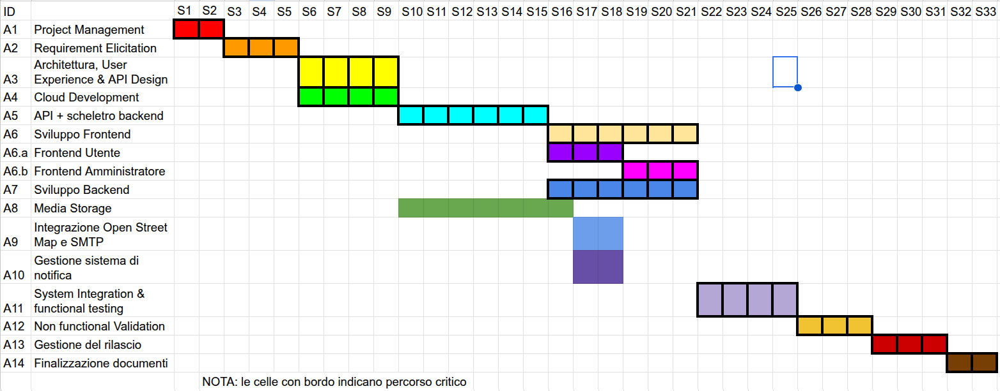

# Product Breakdown Structure (PBS)

| ID | Deliverable | Type  | Notes                                                                                      |
|:---|:------------|:--------------------------------------------------|:-------------------------------------------------------------------------------------------|
| **SOFTWARE** | 
| S1 | Applicazione Web (UI + Client) | Software | Frontend per l'interazione utente.                                                         |
| S2 | Area Riservata Utente | Software | Registrazione, login, gestione profilo e preferenze personali.                             |
| S3 | Dashboard gestionale Amministratori | Software | Pannello di controllo e visualizzazione statistiche per amministratori.                    |
| S3.1 | Modulo Statistiche Amministratore | Software | Visualizzazione statistiche e reportistica.                                                |
| S4 | Servizio Notifiche e Messaggistica | Software | Email, notifiche e messaggi in piattaforma.                                                |
| S5 | API Gateway / BFF | Software | Interfaccia API per frontend e integrazione servizi.                                       |
| S6 | Servizio di Geolocalizzazione | Software | Mappa integrata nella applicazione.Funzioni di ricerca, filtri geografici e tracciabilità. |
| S7 | Servizio di Segnalazione | Software | Creazione e invio delle segnalazioni.                                                      |
| S8 | Consultazione e Monitoraggio | Software | Consultazione pubblica delle segnalazioni, include la funzione "Follow".                   |
| S8.1 | Esportazione CSV | Software | Export dei dati a partire dalla visualizzazione tabellare.                                 |
| **INFRASTRUTTURA** |
| I1 | Cloud Account | Infrastruttura | Setup ambienti cloud.                                                                      |
| I2 | Pipeline CI / CD & Repo GIT | Infrastruttura | Configurazione pipeline di sviluppo repository.                                            |
| I3 | Object Storage | Infrastruttura | Archiviazione delle immagini.                                                              |
| I4 | Database PostgreSQL | Infrastruttura | Progettazione del DB relazionale.                                                          |
| I5 | Integrazione OpenStreetMap | Infrastruttura | Integrazione mappa della città.                                                            |
| I6 | Content Delivery Network (CDN) | Infrastruttura | Configurazione CDN per distribuzione di contenuti.                                         |
| I7 | Sistema di Metriche e Log | Infrastruttura | Monitoraggio errori, prestazioni e log.                                                    |
| I8 | Sistema di Backup | Infrastruttura | Procedure di  salvataggio dati e recovery.                                                 |
| I9 | Servizio Mail | Infrastruttura | SMTP per notifiche e messaggi via email.                                                   |
| I10 | Docker Kubernetes | Infrastruttura | Containerizzazione per scalabilità infrastrutturale.                                       |
| **DOCUMENTAZIONE** |
| D1 | Vision & Scope | Documento | Definizione obiettivi, visione e scopo.                                                    |
| D2 | Documento dei Requisiti | Documento | Analisi funzionale dettagliata.                                                            |
| D3 | Architettura | Documento | Schemi logici, fisici e diagrammi di funzionamento del sistema.                            |
| D4 | Documentazione API (Swagger) | Documento | Specifiche API ed endpoint.                                                                |
| D5 | Strategia di Test | Documento | Piano di test unit, test d'integrazione e test di accettazione.                            |
| D6 | Manualistica di Deploy / Utilizzo | Documento | Istruzioni per installazione e manutenzione.                                               |
| D7 | Guida Utente | Documento | Manuale d'uso per utenti.                                                                  |
| D8 | Sicurezza, Privacy & Legale | Documento | Termini d'uso e sicurezza.                                                                 |
| D9 | Pianificazione Progetto | Documento | Pianificazione e gestione del progetto.                                                    |
---

# Work Breakdown Structure (WBS)

### WBS with traceability to PBS
| ID  | Work package | Traced PBS outputs (IDs) |
|:----|:-------------|:--------------------------|
|1|Project Management|D1, D9|
|2|Requirement Elicitation|D1, D2|
|3|Architettura, User Experience & API Design|S5,D3,D4|
|4|Cloud Development|I1, I2, I7, I8, I10|
|5|API + scheletro backend|S2, S5, I4||
|6|Sviluppo Frontend|S1, S2, S3, S4, S7, S8, I5|
|6.a|Frontend Utente|S1, S2, S4, S7, S8|
|6.b|Frontend Amministratore|S1, S2, S3, S4, S8|
|7| Sviluppo Backend|S2, S3.1, S4, S8, S8.1, I5, I7|
|8|Media Storage|S7, I3, I6|
|9|Integrazione Open Street Map|S6, I5|
|10|Gestione sistema di notifica e mail|S4,I9|
|11|System Integration & functional testing|D5|
|12|Non functional Validation|D5,D8|
|13|Gestione del rilascio |D6,D7|
|14|Finalizzazione documenti |D3,D4,D6,D7,D8,D9|

---

# Gantt, dependencies, and critical path
Finestra temporale assunta: 36 settimane (circa 8 mesi)

## Activity table
| ID | Activity | Duration | Dependencies | Start | End | Critical | Milestone |
|:---|:---------|:---------|:-------------|:------|:----|:------|:---------|
| A1 |Project Management|2 sett| - | S1 | S2 | **Sì** | |
| A2 |Requirement Elicitation|3 sett|A1|S3|S5|**Sì**|**Sì** |
| A3 |Architettura, User Experience & API Design|4 sett|A2|S6|S9|**Sì**|**Sì** |
| A4 |Cloud Development|4 sett|A2|S6|S9|**Sì**||
| A5 |API + scheletro backend|6 sett|A3,A4|S10|S15|**Sì**|**Sì** |
| A6 |Sviluppo Frontend|6 sett|A2,A5|S16|S21|**Sì**||
| A6.a|Frontend Utente|3 sett|A2|S16|S18|**Sì**||
| A6.b|Frontend Amministratore|3 sett|A2|S19|S21|**Sì**||
| A7 |Sviluppo Backend|6 sett|A2,A5|S16|S21||**Si**|
| A8 |Media Storage|6 sett|A3,A4|S10|S16|||
| A9 |Integrazione Open Street Map|3 sett|A5|S16|S18|||
| A10|Gestione sistema di notifica e mail|2 sett|A5|S16|S17|||
| A11|System Integration & functional testing|4 sett|A5,A6,A7|S22|S25|**Sì**|**Sì** |
| A12|Non functional Validation|3 sett|A11|S26|S28|**Sì**|**Sì** |
| A13|Gestione del rilascio |3 sett|A12|S29|S31|**Sì**|**Sì** |
| A14|Finalizzazione documenti |2 sett|A13|S32|S33|**Sì**|**Sì** |

## Critical path
`X → X → X → ...`

---

# Risk Management

**Scales and thresholds**
- **Probability (P)**: 1 (rare) … 5 (almost certain)
- **Impact (I)**: 1 (minor) … 5 (critical)
- **Exposure**: `P × I` (range 1–25)

Risk level thresholds (by exposure):
- **Low**: 1–5
- **Medium**: 6–10
- **High**: 11–16
- **Very High**: >16

## Risks table
| ID | Risk | Category | P | I | P×I | Level | Mitigation / Response strategy |
|:---|:-----|:---------|--:|--:|----:|:------|:-------------------------------|
R01|Cambiamento di requisiti | Requisiti | 4 | 4 | 16 | Alto | MVP chiaro, roadmap definita e approvazione formale dei requisiti. |
R02|Ritardi nello sviluppo | Sviluppo | 3 | 5 | 15 | Alto | Utilizzare metodologie agili per iterazioni rapide e feedback frequenti, identificare e risolvere i colli di bottiglia tempestivamente. |
R03|Problemi di integrazione | Integrazione | 3 | 4 | 12 | Medio | Pianificare fasi di integrazione regolari, con test continui e monitoraggio dei problemi. |
R04|Problemi di risorse | Risorse | 2 | 4 | 8 | Basso | Pianificare le risorse in anticipo, con flessibilità per cambiamenti imprevisti. |
R05|Problemi di qualità | Qualità | 2 | 5 | 10 | Medio | Controllo qualità periodico, con test e revisione del codice. |
R06|Costi di storage inattesi | Costi | 2 | 4 | 8 | Medio | Imporre un limite di dimensioni massime delle immagini delle segnalazioni. |
R07|Problemi di conformità legale | Legale | 1 | 5 | 5 | Basso | Assicurarsi che tutte le normative siano rispettate. |
R08|Problemi di adozione da parte degli utenti | Progetto | 3 | 4 | 12 | Medio | Coinvolgere gli utenti finali durante lo sviluppo, raccogliendo feedback per migliorare l'esperienza utente. |
R09|Scarsa qualità della documentazione finale | Documentazione | 2 | 4 | 8 | Basso | Coinvolgere il committente in revisioni parziali dei documenti (D2,D3, D8). |