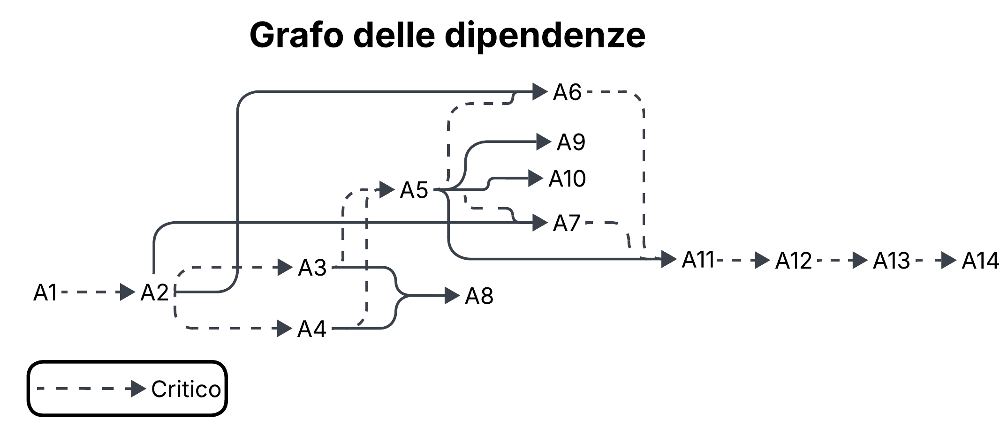

# Product Breakdown Structure (PBS)

| ID | Deliverable | Type  | Notes                                                                                      |
|:---|:------------|:--------------------------------------------------|:-------------------------------------------------------------------------------------------|
| **SOFTWARE** | 
| S1 | Applicazione Web (UI + Client) | Software | Frontend responsive per l'interazione dei cittadini e degli operatori comunali.            |
| S2 | Area Riservata Utente | Software | Gestione autenticazione, profili utente e preferenze di notifica.                             |
| S3 | Dashboard Gestionale Amministratori | Software | Pannello di controllo per la gestione delle segnalazioni e degli uffici tecnici.|
| S3.1 | Modulo Statistiche Amministratore | Software | Visualizzazione di analytics avanzati e reportistica sull'efficienza del servizio.|
| S4 | Dashboard Operatori Comunali | Software | Interfaccia dedicata per la gestione operativa delle segnalazioni e comunicazione con i cittadini. |
| S5 | Servizio Notifiche e Messaggistica | Software | Gestione delle comunicazioni in tempo reale e notifiche push tra sistema e utente.         |
| S6| API Gateway / BFF | Software | Punto di accesso centralizzato per il frontend per aggregare dati dai vari servizi backend. |
| S7 | Servizio di Geolocalizzazione | Software | Logica di georeferenziazione, ricerca di indirizzi e filtri spaziali sulle segnalazioni.   |
| S8 | Servizio di Segnalazione | Software | Motore di gestione del ciclo di vita delle segnalazioni (creazione, workflow di stato).    |
| S9 | Consultazione e Monitoraggio | Software | Portale pubblico per la visualizzazione di mappe, liste e statistiche aperte ai cittadini. |
| S9.1 | Esportazione CSV | Software | Funzionalità di export dei dati tabellari per analisi offline e trasparenza.               |
| **INFRASTRUTTURA** |
| I1 | Cloud Account | Infrastruttura | Piattaforma AWS/Azure per l'hosting scalabile e sicuro di tutti i servizi del sistema.     |
| I2 | Pipeline CI / CD & Repo GIT | Infrastruttura | GitHub Actions e repository Git per l'automazione dei test, della build e del deploy.      |
| I3 | Object Storage | Infrastruttura | Servizio AWS per l'archiviazione sicura e persistente delle immagini delle segnalazioni. |
| I4 | Database PostgreSQL | Infrastruttura | Database relazionale PostgreSQL per la persistenza di utenti, segnalazioni e dati di sistema. |
| I5 | Integrazione OpenStreetMap | Infrastruttura | API e tile server OpenStreetMap per fornire la cartografia e il supporto alla geolocalizzazione. |
| I6 | Content Delivery Network (CDN) | Infrastruttura | Servizio CloudFront per velocizzare la distribuzione di contenuti statici e immagini agli utenti. |
| I7 | Sistema di Backup | Infrastruttura | Procedure di snapshot automatizzate per garantire il ripristino dei dati in caso di guasto. |
| I8 | Servizio Mail | Infrastruttura | Servizio SMTP fornito da Resend per l'invio di notifiche e messaggi via email.             |
| I9 | Docker & Kubernetes | Infrastruttura | Container Docker e cluster Kubernetes per l'orchestrazione e la scalabilità dei microservizi. |
| **DOCUMENTAZIONE** |
| D1 | Vision & Scope | Documento | Definizione obiettivi, visione e scopo.                                                    |
| D2 | Documento dei Requisiti | Documento | Analisi funzionale dettagliata.                                                            |
| D3 | Architettura | Documento | Schemi logici, fisici e diagrammi di funzionamento del sistema.                            |
| D4 | Documentazione API (Swagger) | Documento | Specifiche API ed endpoint.                                                                |
| D5 | Strategia di Test | Documento | Piano di test unit, test d'integrazione e test di accettazione.                            |
| D6 | Manualistica di Deploy / Utilizzo | Documento | Istruzioni per installazione e manutenzione.                                               |
| D7 | Guida Utente | Documento | Manuale d'uso per utenti.                                                                  |
| D8 | Sicurezza, Privacy & Legale | Documento | Termini d'uso e sicurezza.                                                                 |
| D9 | Pianificazione Progetto | Documento | Pianificazione e gestione del progetto.                                                    |

### Scelte Tecnologiche e Infrastrutturali

L'architettura di **Participium** è progettata per essere scalabile, manutenibile e resiliente. Alcune scelte chiave dell'infrastruttura sono state dettate dalla necessità di garantire l'efficacia del servizio pubblico:
*   **Gestione Notifiche (Resend):** È stato preferito l'uso di **Resend** rispetto a un server SMTP gestito internamente per garantire che tutte le nostre mail vengano ricevute dagli utenti. I server email auto-ospitati spesso mancano della reputazione necessaria per superare i filtri spam, un servizio gestito assicura che le notifiche di aggiornamento sulle segnalazioni raggiungano i cittadini senza essere bloccate dai provider di posta.
*   **Cartografia (OpenStreetMap):** L'adozione di **OpenStreetMap** riflette l'approccio *open-source* del progetto. Questa scelta permette di integrare mappe dettagliate della città di Torino senza i costi elevati o i vincoli di tracciamento delle API proprietarie, mantenendo la piena sovranità sui dati geografici.
*   **Containerizzazione (Docker & Kubernetes):** L'intero sistema è containerizzato per garantire che l'ambiente di sviluppo coincida perfettamente con quello di produzione. L'utilizzo di **Kubernetes** ci permette di scalare i servizi (come il modulo di segnalazione o la dashboard) in caso di carichi improvvisi, garantendo la disponibilità del portale anche durante picchi di utilizzo.
*   **Storage Distribuito (Object Storage & CDN):** Le immagini caricate dai cittadini sono archiviate in un **Object Storage** dedicato e distribuite tramite **CDN**. Questo approccio riduce il carico sui server applicativi, accelera il caricamento delle pagine di dettaglio delle segnalazioni e facilita le operazioni di backup e recovery.

---

# Work Breakdown Structure (WBS)

### WBS with traceability to PBS
| ID  | Work package | Traced PBS outputs (IDs) |
|:----|:-------------|:--------------------------|
|1|Project Management|D1, D9|
|2|Requirement Elicitation|D1, D2|
|3|Architettura, User Experience & API Design|S6,D3,D4|
|4|Cloud Development|I1, I2, I7, I9|
|5|API + scheletro backend|S2, S6, I4|
|6|Sviluppo Frontend|S1, S2, S3, S4, S5, S8, S9, I5|
|6.a|Frontend Utente|S1, S2, S5, S8, S9|
|6.b|Frontend Amministratore|S1, S2, S3, S9|
|6.c|Frontend Operatore Comunale|S1, S4, S5|
|7| Sviluppo Backend|S2, S3.1, S5, S9, S9.1, I5|
|8|Media Storage|S8, I3, I6|
|9|Integrazione Open Street Map|S7, I5|
|10|Gestione sistema di notifica e mail|S5,I8|
|11|System Integration & functional testing|D5|
|12|Non functional Validation|D5,D8|
|13|Gestione del rilascio |D6,D7|
|14|Finalizzazione documenti |D3,D4,D6,D7,D8,D9|

---

# Gantt, dependencies, and critical path
Finestra temporale assunta: 33 settimane (circa 8 mesi)

## Activity table
| ID | Activity | Duration | Dependencies | Start | End | Critical | Milestone |
|:---|:---------|:---------|:-------------|:------|:----|:------|:---------|
| A1 |Project Management|2 sett| - | S1 | S2 | **Sì** | |
| A2 |Requirement Elicitation|3 sett|A1|S3|S5|**Sì**|**Sì** |
| A3 |Architettura, User Experience & API Design|4 sett|A2|S6|S9|**Sì**|**Sì** |
| A4 |Cloud Development|4 sett|A2|S6|S9|**Sì**||
| A5 |API + scheletro backend|6 sett|A3, A4|S10|S15|**Sì**|**Sì** |
| A6 |Sviluppo Frontend|6 sett|A2, A5|S16|S21|**Sì**||
| A6.a|Frontend Utente|3 sett|A2, A5|S16|S18|||
| A6.b|Frontend Amministratore|2 sett|A2, A5|S19|S20|||
| A6.c|Frontend Operatore Comunale|1 sett|A2, A5|S21|S21|||
| A7 |Sviluppo Backend|6 sett|A2, A5|S16|S21|**Sì**|**Sì**|
| A8 |Media Storage|6 sett|A3, A4|S10|S15|||
| A9 |Integrazione Open Street Map|3 sett|A5|S16|S18|||
| A10|Gestione sistema di notifica e mail|2 sett|A5|S16|S17|||
| A11|System Integration & functional testing|4 sett|A5, A6, A7|S22|S25|**Sì**|**Sì** |
| A12|Non functional Validation|3 sett|A11|S26|S28|**Sì**|**Sì** |
| A13|Gestione del rilascio |3 sett|A12|S29|S31|**Sì**|**Sì** |
| A14|Finalizzazione documenti |2 sett|A13|S32|S33|**Sì**|**Sì** |

### Nota sulla criticità del Frontend
L'attività **Sviluppo Frontend (A6)** è segnata come critica in quanto il suo completamento è un prerequisito fondamentale per l'inizio dell'integrazione di sistema (A11). Tuttavia, le sotto-attività **A6.a (Frontend Utente)**, **A6.b (Frontend Amministratore)** e **A6.c (Frontend Operatore Comunale)** non sono individualmente critiche perchè hanno flessibilità interna: un eventuale ritardo in una delle tre può essere compensato o assorbito all'interno della finestra temporale totale di 6 settimane destinata al frontend, senza traslare necessariamente la data di fine di A6.

## Critical path
`A1 → A2 → (A3||A4) → A5 → (A6||A7) → A11 → A12 → A13 → A14`

---

# Risk Management

**Scales and thresholds**
- **Probability (P)**: 1 (rare) … 5 (almost certain)
- **Impact (I)**: 1 (minor) … 5 (critical)
- **Exposure**: `P × I` (range 1–25)

Risk level thresholds (by exposure):
- **Low**: 1–5
- **Medium**: 6–10
- **High**: 11–16
- **Very High**: >16

## Risks table
| ID | Risk | Category | P | I | P×I | Level | Mitigation / Response strategy |
|:---|:-----|:---------|--:|--:|----:|:------|:-------------------------------|
R01| Scalabilità (latenza sistema sotto alto traffico)| Tecnico| 3 |5|15|Alto| Stress test, ottimizzazione query e asset| 
R02|Cambiamento di requisiti | Requisiti | 4 | 4 | 16 | Alto | MVP chiaro, roadmap definita e approvazione formale dei requisiti. |
R03|Ritardi nello sviluppo | Sviluppo | 3 | 5 | 15 | Alto | Utilizzare iterazioni rapide e feedback frequenti, identificare e risolvere i colli di bottiglia tempestivamente. |
R04|Problemi di integrazione | Integrazione | 3 | 4 | 12 | Alto | Pianificare fasi di integrazione regolari, con test continui e monitoraggio dei problemi. |
R05|Problemi di risorse | Risorse | 2 | 4 | 8 | Medio | Pianificare le risorse in anticipo, con flessibilità per cambiamenti imprevisti. |
R06|Problemi di qualità | Qualità | 2 | 5 | 10 | Medio | Controllo qualità periodico, con test e revisione del codice. |
R07|Costi inattesi servizi esterni | Costi | 2 | 4 | 8 | Medio |Previsioni errate su costi di Storage e Cloud. Imporre un limite di immagini nelle segnalazioni. |
R08|Problemi di conformità legale | Legale | 1 | 5 | 5 | Medio | Assicurarsi che tutte le normative siano rispettate. |
R09|Utilizzo utente | Progetto | 3 | 4 | 12 | Alto | Coinvolgere gli utenti finali durante lo sviluppo, raccogliendo feedback per migliorare l'esperienza utente. |
R10|Scarsa qualità della documentazione finale | Documentazione | 2 | 4 | 8 | Medio | Coinvolgere il committente in revisioni parziali dei documenti (D2,D3, D8). |
