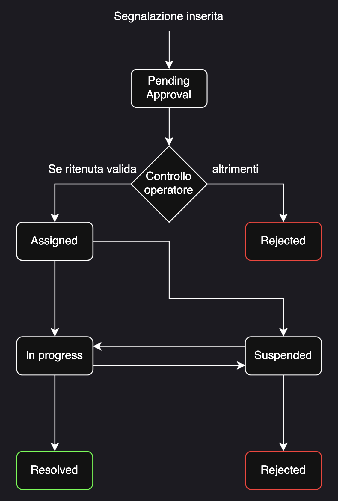

# 1) Stakeholders

| ID     | Stakeholder name               | Description                                                                                 | Role                       | Main concerns                                                                                                                                                        |
|:-------|:-------------------------------|:--------------------------------------------------------------------------------------------|:---------------------------|:---------------------------------------------------------------------------------------------------------------------------------------------------------------------|
| STK-01 | Cittadino                      | Utente finale. Può essere autenticato o meno (visitatore).                                  | Utilizzatore               | Semplicità d'uso, attenzione alla privacy e ai dati personali, efficienza nella comunicazione dei problemi.                                                          |
| STK-02 | Operatore Comunale             | Personale degli uffici tecnici incaricato della gestione delle segnalazioni.                | Utilizzatore / Gestore     | Carico di lavoro, precisione delle segnalazioni, comunicazione con i cittadini.                                                                                      |
| STK-03 | Amministratore                 | Personale IT e incaricato dell'analisi dei requisiti e della valutazione delle performance. | Gestore Tecnico / Analista | Sicurezza dei dati, scalabilità dell'infrastruttura, reportistica per il Comune Analisi dei dati, valutazione delle performance, feedback sugli aspetti funzionali.  |
| STK-04 | Comune di Torino               | Ente pubblico che adotta e finanzia il sistema.                                             | Committente                | Efficienza operativa, feedback positivi, conformità legale.                                                                                                          |
| STK-05 | Sviluppatore                   | Incaricato dello sviluppo del sistema.                                                      | Sviluppatore               | Sviluppo delle funzionalità richieste, qualità del codice, tempi di sviluppo.                                                                                        |
| STK-06 | Servizi di archiviazione Cloud | Fornitori di servizi cloud per  storage delle immagini.                                     | Sistema Esterno            | Disponibilità, performance, costi.                                                                                                                                   |
| STK-07 | Content Delivery Network (CDN) | Fornitori di servizi CDN per distribuzione rapida dei contenuti.                            | Sistema Esterno            | Velocità di distribuzione, affidabilità, costi.                                                                                                                      |
| STK-08 | Servizio di Autenticazione     | Fornitori di servizi per gestione dell'autenticazione e sicurezza.                          | Sistema Esterno            | Sicurezza, facilità d'integrazione, costi.                                                                                                                           |
| STK-09 | Servizio di Notifica           | Fornitori di servizi per invio di notifiche push o email.                                   | Sistema Esterno            | Affidabilità, facilità d'integrazione, costi.                                                                                                                        |

---

# 2) Context Diagram

Il diagramma di contesto mostra il funzionamento generale del sistema **Participium** e le sue interazioni con le entità
esterne.

**Legenda:**

- **Arancione:** Rappresenta gli attori (persone o ruoli) che interagiscono direttamente con il sistema (Cittadini,
  Operatori, Amministratori).
- **Verde:** Rappresenta i sistemi e i servizi esterni integrati (OpenStreetMap, Resend, Cloud Storage).
- **Frecce:** Indicano la direzione del flusso di dati tra Participium e le entità.

---

# 3) Interfaces

| ID    | Interface                         | Actor                                                       | Physical interface                        | Logical interface                                    |
|:------|:----------------------------------|:------------------------------------------------------------|:------------------------------------------|:-----------------------------------------------------|
| IF-01 | Web app                           | Cittadino                                                   | Smartphone/PC con connessione ad Internet | Applicazione web responsive                          |
| IF-02 | Dashboard amministrativa          | Operatore Comunale / Amministratore                         | PC con connessione a Internet             | Dashboard gestionale e di amministrazione            |
| IF-03 | Map Service API                   | Servizio OpenStreetMap [(I5)](./01_ProjectManagement.md)    | Connessione a Internet                    | API per geolocalizzazione                            |
| IF-04 | Media Storage API                 | Object Storage [(I3)](./01_ProjectManagement.md)            | Connessione a Internet                    | API per upload/download immagini segnalazioni        |
| IF-05 | Content Delivery Network          | CDN [(I6)](./01_ProjectManagement.md)                       | Connessione a Internet                    | Interfaccia per distribuzione rapida contenuti       |
| IF-06 | Servizio mail                     | Protocollo SMTP                                             | Connessione a Internet                    | SMTP per invio notifiche email                       |
| IF-07 | Servizio di notifiche             | Cittadino                                                   | Connessione a Internet                    | API per invio notifiche push                         |
| IF-08 | Sistema di monitoraggio e logging | Sistema di Metriche e Log [(I7)](./01_ProjectManagement.md) | Connessione a Internet                    | Dashboard per monitoraggio prestazioni e errori      |
| IF-09 | Servizio Cloud                    | Cloud Account [(I1)](./01_ProjectManagement.md)             | Connessione a Internet                    | Piattaforma per hosting                              |
| IF-10 | Servizio di autenticazione        | Cittadino / Amministratore / Operatore Comunale             | Connessione a Internet                    | API REST per login, registrazione e gestione profilo |

---

# 4) Personas

| ID     | Name     | Role      | Background / Context      | Goals     | Constraints       | Devices / Usage setting       | Accessibility / Additional needs|
|:-------|:---------|:---------------------------------|:------------------------------------------------------------------------------------------------------------------------|:-----------------------------------------------------------------------------------------------------------------------|:-----------------------------------------------------------------------------------------------------------------------|:----------------------------------------------|:-----------------------------------------------------------------------------------------------|
| PER-01 | Marco    | Cittadino (autenticato)| Residente a Torino centro, 35 anni. Nota spesso problemi urbani (buche, lampioni) nel tragitto casa-lavoro.| Segnalare disservizi e ricevere aggiornamenti sullo stato delle sue segnalazioni.| Scarsa pazienza per form complicati.| Smartphone.                | Interfaccia ad alto contrasto per uso all'aperto.                                              |
| PER-02 | Emanuele | Cittadino (autenticato)| Utente di 45 anni, occasionalmente utilizza postazioni internet pubbliche o condivise per gestire pratiche digitali. | Effettuare una segnalazione rapida e terminare la sessione in totale sicurezza per proteggere la propria identità.| Forte preoccupazione ed attenzione alla gestione dei propri dati.| PC/Terminale condiviso, connessione pubblica. | Necessità di un logout automatico dopo un certo periodo di inattività.|
| PER-03 | Pietro   | Cittadino (autenticato)| Studente universitario fuori sede, 20 anni. Vive in periferia, utilizza molto la bicicletta e i mezzi pubblici.        | Segnalare piste ciclabili ostruite o fermate dell'autobus danneggiate per migliorare la mobilità.| Hardware quasi pieno (poca RAM/Storage) e piano dati limitato . | Smartphone entry-level.             | Feedback sonori per confermare l'invio della segnalazione senza guardare lo schermo.                          |
| PER-04 | Giuseppe | Cittadino (visitatore)           | Cittadino anziano, 78 anni. Ha difficoltà con l'utilizzo di dispositivi elettronici.| Consultare la mappa per vedere se i problemi della sua via sono già stati segnalati.| Difficoltà di lettura e nella comprensione di termini tecnologiche.| Smartphone (uso saltuario), Wi-Fi domestico.  | Font molto grandi; icone intuitive.|
| PER-05 | Giulia   | Operatore Comunale               | Dipendente comunale, 50 anni. Gestisce decine di ticket al giorno.| Filtrare segnalazioni e assegnare priorità senza errori.| Deve rispettare i tempi di risposta previsti dal regolamento comunale (SLA).| PC Desktop, Tablet.| Facilità di lettura di mappe e coordinate GPS. Ipovedente, necessita di font ridimensionabili. |
| PER-06 | Matteo   | Operatore Comunale| Dipendente comunale di 28 anni. Riceve gli incarichi sul tablet e deve recarsi sul luogo per verificare il danno.       | Documentare il danno con foto e ulteriori informazioni.| Lavora spesso in zone con poco segnale.| Tablet.| Interfaccia con tasti grandi e modalità dettatura per le note.|
| PER-07 | Sandro   | Amministratore (gestore tecnico) | Sistemista esperto, 42 anni. Si occupa della stabilità e della sicurezza della piattaforma.| Assicurare che il sistema sia sempre online, non ci siano violazioni di sicurezza e che i dati siano salvati (Backup). | Deve operare con permessi limitati sui dati sensibili (GDPR).| Laptop professionale, VPN/SSH.| Dashboard di monitoraggio.                                                  |
| PER-08 | Alessia  | Amministratore (data analyst)    | Data Analyst , 38 anni. Analizza i flussi di dati per ottimizzare i servizi comunali.| Estrarre report periodici sui tempi di intervento e identificare le zone della città con più disservizi.| Deve garantire l'anonimato dei cittadini nei report pubblici (Open Data).                                              | PC Desktop| Visualizzazioni grafiche avanzate, esportazioni in formato CSV.                 |

---

# 5) User Stories

| ID    | Persona/Role                              | User story (As a… I want… so that…)                                                                                                                                                                                                     |
|:------|:------------------------------------------|:----------------------------------------------------------------------------------------------------------------------------------------------------------------------------------------------------------------------------------------|
| US-01 | Marco - Cittadino (autenticato)           | Come cittadino, voglio poter modificare le mie credenziali d'accesso e il mio profilo utente così da poter mantenere aggiornata la mia identità.|
| US-02 | Marco - Cittadino (autenticato)           | Come cittadino, voglio poter recuperare le mie credenziali autonomamente, così da rientrare in possesso del mio account senza doverne creare uno nuovo.|     
| US-03 | Marco - Cittadino (autenticato)           | Come cittadino, voglio poter effettuare un follow di una segnalazione e ricevere notifiche quando la segnalazione cambia stato, così da sentirmi coinvolto nel processo.|
| US-04 | Marco - Cittadino (autenticato)           | Come cittadino autenticato, voglio scambiare messaggi con l'operatore comunale, così da facilitare l'intervento e fornire eventuali chiarimenti richiesti.|
| US-05 | Marco - Cittadino (autenticato)           | Come cittadino, voglio avere accesso alle segnalazioni da me effettuate così da tenerne traccia.|
| US-06 | Giuseppe - Cittadino (visitatore)         | Come cittadino visitatore voglio visualizzare la mappa anche in versione tabellare delle segnalazioni così da avere una panoramica strutturata dei problemi urbani.|  
| US-07 | Giuseppe - Cittadino (visitatore)         | Come cittadino voglio visualizzare i dettagli delle segnalazioni così che io possa informarmi sui problemi del mio quartiere.|
| US-08 | Giuseppe - Cittadino (visitatore)         | Come cittadino visitatore, voglio consultare le statistiche pubbliche sulle segnalazioni così da avere una visione aggregata dei problemi della città.|  
| US-09 | Giuseppe - Cittadino (visitatore)         | Come cittadino visitatore voglio potermi registrare facilmente così che io possa effettuare segnalazioni sui disservizi del quartiere.|
| US-10 | Emanuele - Cittadino (autenticato)        | Come cittadino, voglio avere la possibilità di esportare le segnalazioni in CSV per condurre un'analisi personale.|
| US-11 | Emanuele - Cittadino (autenticato)        | Come cittadino, voglio poter effettuare un logout così da proteggere il mio account quando uso dispositivi condivisi.|
| US-12 | Emanuele - Cittadino (autenticato)        | Come cittadino, voglio poter accedere al sistema utilizzando le mie credenziali, tenendo traccia delle mie attività.|
| US-13 | Pietro - Cittadino (autenticato)          | Come cittadino, voglio segnalare malfunzionamenti alle infrastrutture per la mobilità sostenibile allegando foto, posizione su mappa e descrizione, così da contribuire al miglioramento dei servizi.|
| US-14 | Pietro - Cittadino (autenticato)          | Come cittadino, voglio effettuare ricerche filtrate e ordinate, così da individuare rapidamente i problemi che mi interessano.|
| US-15 | Giulia - Operatore comunale               | Come operatore, voglio poter rifiutare segnalazioni aggiungendo una motivazione così da spiegare al cittadino il motivo della mancata presa in carico.|
| US-16 | Giulia - Operatore comunale               | Come operatore, voglio poter comunicare direttamente con il cittadino tramite il servizio di messaggistica così da richiedere chiarimenti riguardanti la segnalazione effettuata.|
| US-17 | Matteo - Operatore Comunale               | Come operatore comunale, voglio gestire e aggiornare gli stati delle segnalazioni, così da mantenere i cittadini informati sull'avanzamento della risoluzione del problemain modo trasparente.|    
| US-18 | Sandro - Amministratore (gestore tecnico) | Come amministratore, voglio gestire gli utenti e i permessi di accesso così da garantire la sicurezza del sistema.|
| US-19 | Sandro - Amministratore (gestore tecnico) | Come amministratore, voglio creare altri amministratori e creare gli account per gli operatori comunali così da garantire i permessi corretti.|   
| US-20 | Alessia - Amministratore (data analyst)   | Come amministratore, voglio generare report avanzati sull'andamento delle segnalazioni, così da monitorare l'efficienza operativa e suggerire interventi preventivi al comune.|   

---

# 6) Functional Requirements (FR)

| ID      | Requirement statement (The system shall…)| Priority | User story ID  | Notes|
|:--------|:------------------------------------------------------------------------------------------------------|:---------|:---------------|:-------------------------------------------------------------------------------------------------------------------------------------------------------------------------------------------------------------------------------------------------------------------------------------------------------|
| FR-1  | Il sistema deve consentire ai cittadini di creare l'account                                           | Alta     | US-09 | I cittadini per registrarsi devono fornire username, nome, cognome, indirizzo email e password.|
| FR-1.1  | Il sistema deve assicurarsi che l'utente fornisca una password sicura | Bassa     |US-09 | Dopo l'inserimento della password da parte dell'utente, il sistema deve attuare una validazione della password, assicurandosi che ogni password contenga almeno una lettera maiuscola, un numero e un carattere speciale. |
| FR-1.2 | Il sistema deve verificare l'email utilizzata durante la registrazione | Alta     | US-09           | Il sistema deve inviare un'email di verifica contenente un link di verifica; l'account dell'utente deve rimanere inattivo fino a quando non viene verificato l'email. |
| FR-2    | Il sistema deve consentire agli utenti registrati di effettuare il login                              | Alta     | US-09 | Il login viene effettuato inserendo username/email e password dell'utente.|
| FR-3  | Il sistema deve consentire agli utenti registrati di effettuare un reset della password               | Alta     | US-02           | Se un utente non ricorda la password, deve essere possibile resettarla tramite un link email.|
| FR-4    | Il sistema deve consentire agli utenti autenticati di effettuare un logout                            | Alta     | US-11          ||
| FR-5    | Il sistema deve permettere la visione e la modifica dei dati personali per gli account registrati     | Media    | US-01          | I dati personali come email, password, username e preferenza di notifica devono essere visualizzabili e deve esserci la possibilità di cambiarli.|
| FR-5.1  | Il sistema deve permettere l'inserimento della foto profilo                                           | Bassa    |          | Per i cittadini registrati deve essere possibile (opzionalmente) l'inserimento di una foto profilo|
| FR-6   | Il sistema deve consentire ai cittadini di inserire le segnalazioni                                   | Alta     |           | Possibile solo per i cittadini autenticati. le segnalazioni includono: titolo, posizione scelta tramite mappa, descrizione, categoria e da 1 a 3 foto.|
| FR-6.1 | Il sistema deve consentire ai cittadini di nascondere la proria identità nelle segnalazioni tramite opzione di anonimato pubblico | Alta     |          | Deve essere possibile contrassegnare una segnalazione come anonima. In tal caso l'identità non è mostrata pubblicamente.                                                                                                       |
| FR-6.2 | Il sistema deve permettere di selezionare una categoria per la segnalazione da un elenco predefinito  | Alta     | US-12          | Le categorie tra cui è possibile scegliere sono: Waterworks, Architectural Barriers, Sewerage, Public Lighting, Waste, Road Signs and Traffic Lights, Roads and Urban Furniture, Public Green Areas and Playgrounds, Other.|
| FR-7   | Il sistema deve permettere agli operatori comunali di approvare o rifiutare le segnalazioni        | Alta     |         | Se una segnalazione è ritenuta valida da un operatore comunale deve essere approvata e assegnata (Assigned), altrimenti deve essere respinta.|
| FR-7.1 | Il sistema deve garantire una motivazione nel caso di segnalazione respinta                        | Alta    | US-14          | Non deve essere possibile rifiutare una segnalazione senza fornire una motivazione.|
| FR-8   | Il sistema deve gestire gli stati delle segnalazioni                                                  | Alta     | US-16          | Il sistema deve gestire gli stati delle segnalazioni: assigned, in progress, suspended, rejected, resolved|
| FR-9   | Il sistema deve generare una notifica quando una segnalazione cambia di stato                         | Media    | US-03, US-16   | Se una segnalazione cambia di stato deve esser generata automaticamente una notifica per il cittadino segnalante e per i cittadini che hanno scelto di seguire la segnalazione. Deve inoltre essere inviata una email agli utenti che lo hanno richiesto.|
| FR-10    | Il sistema deve consentire la visualizzazione delle segnalazioni su mappa                             | Media    | US-06          | La mappa con eventuali pin per le segnalazioni deve essere visibile sia agli utenti registrati sia ai visitatori non registrati.|
| FR-11  | Il sistema deve consentire la visualizzazione delle segnalazioni in versione tabellare                | Media    | US-06          | Le segnalazioni in versione tabellare deve essere visibile sia agli utenti registrati sia ai visitatori non registrati.|
| FR-11.1    | Il sistema deve consentire la ricerca testuale delle segnalazioni                                     | Media    | US-13          | La ricerca deve essere accessibile sia agli utenti registrati sia ai visitatori|
| FR-11.2  | Il sistema deve consentire il filtraggio delle segnalazioni                                           | Media    | US-13          | I filtri per categoria, stato e intervallo temporale devono essere combinabili tra loro e accessibili sia agli utenti registrati sia ai visitatori.|
| FR-11.3 | Il sistema deve consentire l'ordinamento delle segnalazioni in base a un criterio                      | Bassa    | US-13          | Possibili criteri sono ordine alfabetico, data di inserimento, categoria, stato ecc.|
| FR-12  | Il sistema deve permettere ai cittadini di visualizzare l'elenco delle proprie segnalazioni           | Media    | US-05          | La visualizzazione delle proprie segnalazioni è riservata ai cittadini autenticati.|
| FR-13    | Il sistema deve consentire l'accesso ai dettagli delle segnalazioni          | Alta     | US-07          | Il dettaglio delle segnalazioni comprende tutte le informazioni: titolo, descrizione, categoria, autore, data, posizione geografica, foto, stato corrente e storico.|
| FR-14   | Il sistema deve consentire il follow delle segnalazioni                                               | Media    | US-03          | I cittadini registrati devono poter attivare il follow di una qualsiasi segnalazione in modo da seguirne lo stato e ricevere aggiornamenti.|
| FR-15   | Il sistema deve gestire il servizio di messaggistica diretta tra cittadino e operatore                | Alta     | US-04, US-15   | Operatori e cittadini autenticati possono scambiarsi messaggi relativi ad una segnalazione tramite piattaforma al fine di richiedere chiarimenti o agiornamenti. Il sistema manterrà traccia dei messaggi scambiati.|
| FR-16   | Il sistema deve generare le statistiche pubbliche                                                     | Media    | US-08          | Le statistiche pubbliche come numero di segnalazioni per categoria e trend nel tempo devono essere visibili sia dagli utenti registrati sia ai non registrati.                                                                                                                                        |
| FR-17   | Il sistema deve generare le statistiche private                                                       | Media    | US-19          | Le statistiche private come numero di segnalazioni per stato, per tipologia, per segnalante, segnalazioni inserite dal top 1% e top 5% dei segnalanti, devono essere visibili ai soli amministratori. |
| FR-18   | Il sistema deve consentire l'esportazione delle segnalazioni in CSV                                   | Bassa    | US-10| |
| FR-19   | Il sistema deve consentire la creazione di molteplici account con privilegi di amministratore         | Alta     | US-18          | Il primo account amministratore viene creato durante la creazione del sistema e poi ogni amministratore può creare altri amministratori.|
| FR-20    | Il sistema deve consentire agli amministratori di creare  gli account per gli operatori comunali      | Alta     | US-18||
| FR-21   | Il sistema deve consentire agli amministratori di gestire gli account degli utenti                    | Alta     | US-17          | Le azioni possibili devono comprendere: sospendere, bannare o limitare temporaneamente un account.|

## Nota sulle transizioni tra stati

Una segnalazione entra automaticamente nello stato **pending approval** nel momento in cui viene creata dal cittadino.
Da questo punto, tutte le transizioni successive sono attivate manualmente dall'operatore comunale. Se l'operatore
ritiene valida la segnalazione cambia stato in **assigned** segnalando la presa in carico, in caso contrario può essere
direttamente **rejected** con motivazione obbligatoria da parte dell'operatore. Una volta assegnata l'operatore avvia l'
intervento portandola in **in progress**, oppure la sospende temporaneamente tramite lo stato **suspended**. Dallo stato
**in progress** la segnalazione può essere sospesa tramite **suspended** oppure chiusa come **resolved** una volta
completato l'intervento. Una segnalazione sospesa può essere ripresa tramite lo stato **in progress**. Gli stati *
*resolved** e **rejected** sono terminali dunque una
segnalazione che vi entra non può più cambiare stato.

---

# 7) Non-Functional Requirements (NFR)

| ID     | Category             | Requirement statement                                                                              | Metric / Target                                                                                           | Verification                                                                  | Priority | Notes                                                                                                         |
|:-------|:---------------------|:---------------------------------------------------------------------------------------------------|:----------------------------------------------------------------------------------------------------------|:------------------------------------------------------------------------------|:---------|:--------------------------------------------------------------------------------------------------------------|
| NFR-01 | Usabilità            | L'applicazione web deve essere responsive per l'uso da mobile                                      | Il layout si adatta senza scrolling orizzontale su schermi da minimo 320 pixel di larghezza               | Ispezione visiva e UI test automatici su emulatori                            | Alta     | Essenziale poichè la maggior parte delle segnalazioni avvengono direttamente in strada                        |
| NFR-02 | Prestazioni          | La mappa pubblica deve caricarsi rapidamente                                                       | Rendering iniziale in meno di 3 secondi su rete 4G                                                        | Performance testing automatizzato                                             | Alta     | La mappa è l'elemento centrale, la velocità di caricamento sulle reti mobili è essenziale sia elevata         |
| NFR-03 | Sicurezza (Security) | Tutela rigorosa dell'opzione di anonimato pubblico                                                 | Nessuna occorrenze di dati identificativi ( nome,cognome,email) nei payload API pubblici                  | Analisi statica del codice e Penetration Test                                 | Alta     | Bilancia la trasparenza pubblica con la privacy del cittadino                                                 |
| NFR-04 | Prestazioni          | Elaborazione efficiente degli allegati, fino a tre foto                                            | Upload ed elaborazione di tre immagini, massimo 5 MB cadauno, in meno di 5 secondi totali nel lato server | Load testing sull'endpoint di upload                                          | Media    | Si limita la dimensione per garantire la velocità in mobilità mantenendo una qualità visiva utile agli uffici |
| NFR-05 | Sicurezza (Security) | Accesso alle statistiche private limitato agli amministratori                                      | Il 100% dei tentativi di accesso da utenti non-admin genera errore HTTP 403                               | Test automatizzati di autorizzazione                                          | Alta     | Previene la fuga di dati aggregati non destinati alla consultazione pubblica                                  |
| NFR-06 | Interpolabilità      | Esportazione dati tabellari in formato CSV                                                         | Conformità totale allo standard RFC 4180, nessun errore in Excel/Sheets                                   | Ispezione tramite validatori CSV                                              | Media    | Garantisce trasparenza e usabilità dei dati offline per analisi esterne da parte di cittadini                 |
| NFR-07 | Affidabilità         | Invio tempestivo delle notifiche email                                                             | Il 95% delle email consegnate al server SMTP entro 2 minuti dal cambio di stato                           | Analisi automatizzata di log                                                  | Media    | Una comunicazione rapida è necessaria per mantenere alto engagement del cittadino                             |
| NFR-08 | Accessibilità        | Interfaccia pubblica accessibile a cittadini con disabilità                                        | Conformità livello AA delle linee guida WCAG 2.1                                                          | Test con tool automatici e navigazione con screen reader                      | Alta     | Requisito normativo e morale essenziale per un servizio di pubblica amministrazione                           | 
| NFR-09 | Portabilità          | Sistema facilmente distribuibile per l'adozione open-source                                        | Avvio completo (DB, Backend,Frontend) via script in meno di 15 minuti su server                           | Test di deployment in ambiente isolato                                        | Media    | Se l'installazione fosse complessa nessun altro comune adotterebbe la piattaforma                             |
| NFR-10 | Disponibilità        | Alta disponibilità per inserimento segnalazioni e consultazioni                                    | L'ultime del sito web e delle API pubbliche deve essere garantito per almeno il 99,9% del tempo ogni mese | Monitoraggio sintetico continuo                                               | Alta     | Il servizio deve essere sempre attivo, specialmente per segnalare problemi in situazioni di emergenza urbana  |
| NFR-11 | Sicurezza (Security) | Il sistema deve gestire i dati personali garantendo riservatezza e integrità in conformità al GDPR | Gestione dei dati in accordo con le normative vigenti(GDPR)                                               | Security Audit, Penetration Test e verifica dei registri di trattamento dati. | Alta     | -                                                                                                             |
| NFR-12 | Sicurezza (Security) | Le comunicazioni tra i client e il sistema devono utilizzare il protocollo HTTPS                   | 100% del traffico cifrato via TLS 1.2 o superiore; Certificato SSL/TLS valido                             | Analisi del traffico (Wireshark) e scansione degli endpoint (es. SSL Labs)    | Alta     | -                                                                                                             |

