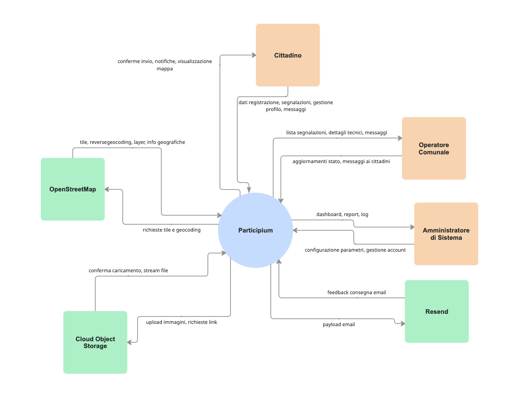

# 1) Stakeholders

| ID     | Stakeholder name               | Description                                                                                      | Role                   | Main concerns                                                                                                                  |
|:-------|:-------------------------------|:-------------------------------------------------------------------------------------------------|:-----------------------|:-------------------------------------------------------------------------------------------------------------------------------|
| STK-01 | Cittadino                      | Utente finale. Può essere autenticato o meno (visitatore). | Utilizzatore           | Semplicità d'uso, attenzione alla privacy e ai dati personali, efficienza nella comunicazione dei problemi. |
| STK-02 | Operatore Comunale             | Personale degli uffici tecnici incaricato della gestione delle segnalazioni.                     | Utilizzatore / Gestore | Carico di lavoro, precisione delle segnalazioni, comunicazione con i cittadini.                                               |
| STK-03 | Amministratore di Sistema      | Personale IT e Data Analyst.| Gestore Tecnico | Sicurezza dei dati, scalabilità dell'infrastruttura, reportistica per il Comune.                                           |
| STK-04 | Comune di Torino               | Ente pubblico che adotta e finanzia il sistema.                                                  | Committente            | Efficienza operativa, feedback positivi, conformità legale.                                                                    |
| STK-05 | Sviluppatore                   | Incaricato dello sviluppo del sistema.                                                           | Sviluppatore           | Sviluppo delle funzionalità richieste, qualità del codice, tempi di sviluppo.                                                  |
| STK-06 | Analista                       | Personale incaricato dell'analisi dei requisiti e della valutazione delle performance.           | Analista               | Analisi dei dati, valutazione delle performance, feedback sugli aspetti funzionali.                                            |
| STK-07 | Servizi di archiviazione Cloud | Fornitori di servizi cloud per  storage delle immagini.                                          | Sistema Esterno        | Disponibilità, performance, costi.                                                                                             |
| STK-08 | Content Delivery Network (CDN) | Fornitori di servizi CDN per distribuzione rapida dei contenuti.                                 | Sistema Esterno        | Velocità di distribuzione, affidabilità, costi.                                                                                |
| STK-09 | Servizio di Autenticazione     | Fornitori di servizi per gestione dell'autenticazione e sicurezza.                               | Sistema Esterno        | Sicurezza, facilità d'integrazione, costi.                                                                                     |
| STK-10 | Servizio di Notifica           | Fornitori di servizi per invio di notifiche push o email.                                        | Sistema Esterno        | Affidabilità, facilità d'integrazione, costi.                                                                                  |
---

# 2) Context Diagram

Il diagramma di contesto mostra il funzionamento generale del sistema **Participium** e le sue interazioni con le entità esterne.

**Legenda:**
- **Arancione:** Rappresenta gli attori (persone o ruoli) che interagiscono direttamente con il sistema (Cittadini, Operatori, Amministratori).
- **Verde:** Rappresenta i sistemi e i servizi esterni integrati (OpenStreetMap, Resend, Cloud Storage).
- **Frecce:** Indicano la direzione del flusso di dati tra Participium e le entità.

---

# 3) Interfaces

| ID    | Interface | Actor       | Physical interface | Logical interface |
|:------|:----------|:------------|:-------------------|:------------------|
| **IF-01** | Web App | Cittadino / Visitatore | Smartphone/PC con connessione ad Internet | Applicazione web responsive |
| **IF-02** |Dashboard amministrativa | Operatore Comunale / Amministratori | PC con connessione ad Internet | Dashboard gestionale e di amministrazione |
| **IF-03** | Map Service API | Servizio OpenStreetMap [(I5)](./01_ProjectManagement.md)  | Connessione a Internet | API per geolocalizzazione |
| **IF-04** | Media Storage API | Object Storage [(I3)](./01_ProjectManagement.md)  | Connessione a Internet | API per upload/download immagini segnalazioni |
| **IF-05** | Content Delivery Network | CDN [(I6)](./01_ProjectManagement.md) | Connessione a Internet | Interfaccia per distribuzione rapida contenuti |
| **IF-06** | Servizio mail | Protocollo SMTP  | Connessione a Internet | SMTP per invio notifiche email |
| **IF-07** | Servizio di notifiche | Cittadino | Connessione Internet | API per invio notifiche push |
| **IF-08** | Sistema di monitoraggio e logging | Sistema di Metriche e Log [(I7)](./01_ProjectManagement.md)  | Connessione a Internet | Dashboard per monitoraggio prestazioni e errori |
| **IF-09** | Servizio Cloud | Cloud Account [(I1)](./01_ProjectManagement.md) | Connessione Internet | Piattaforma per hosting |
| **IF-10** | Servizio di autenticazione | Cittadino / Amministratore / Operatore Comunale | Connessione Internet | API REST per login, registrazione e gestione profilo |

---

# 4) Personas

| ID     | Name      | Role                    | Background / Context                                                                                                  | Goals                                                                                                                  | Constraints                                                                                      | Devices / Usage setting                      | Accessibility / Additional needs                                                               |
|:-------|:----------|:------------------------|:----------------------------------------------------------------------------------------------------------------------|:-----------------------------------------------------------------------------------------------------------------------|:-------------------------------------------------------------------------------------------------|:---------------------------------------------|:-----------------------------------------------------------------------------------------------|
| PER-01 | Marco     | Cittadino (autenticato) | Residente a Torino in zona centrale, 35 anni. Nota spesso problemi urbani (buche, lampioni) nel tragitto casa-lavoro. | Segnalare disservizi e ricevere aggiornamenti sullo stato.                                         | Scarsa pazienza per form complicati; preoccupato per la privacy dei dati.                        | Smartphone (On-the-go), 4G/5G.               | Interfaccia ad alto contrasto per uso all'aperto.     
| PER-02 | Emanuele     | Cittadino (autenticato) | Utente di 45 anni che occasionalmente utilizza postazioni internet pubbliche o condivise per gestire pratiche digitali. |  Effettuare una segnalazione rapida e terminare la sessione in totale sicurezza per proteggere la propria identità. |   Forte preoccupazione per la privacy.  | PC/Terminale condiviso, connessione pubblica.  |        |
| PER-03 | Pietro    | Cittadino (autenticato) | Studente universitario fuori sede, 20 anni. Vive in periferia e utilizza molto la bicicletta e i mezzi pubblici.      | Segnalare piste ciclabili ostruite o fermate dell'autobus danneggiate per migliorare la mobilità.                      | Hardware limitato (poca RAM/Storage); piano dati ridotto; necessità di operare con una sola mano mentre è in transito. | Smartphone (entry-level), Tablet.            | Necessita di feedback sonori per la conferma dell'invio segnalazione.                          |
| PER-04 | Giuseppe  | Cittadino (visitatore)  | Cittadino anziano, 78 anni. Ha difficoltà con l'utilizzo di dispositivi elettronici.   |  Consultare la mappa per vedere se i problemi della sua via sono già stati segnalati.   |   Difficoltà di lettura       | Smartphone (uso saltuario), Wi-Fi domestico. | Font molto grandi; icone intuitive.              |
| PER-05 | Giulia    | Operatore Comunale      | Dipendente comunale, 50 anni. Gestisce decine di ticket al giorno.        | Filtrare segnalazioni fasulle, assegnare priorità e smistarle correttamente ai reparti competenti senza errori.        | Deve rispettare i tempi di risposta previsti dal regolamento comunale (SLA).                     | PC Desktop (Ufficio), Tablet.                | Facilità di lettura di mappe e coordinate GPS. Ipovedente: necessita di font ridimensionabili. |
| PER-06 | Matteo    | Operatore Comunale      | Dipendente comunale di 28 anni. Riceve gli incarichi sul tablet e deve recarsi sul luogo per verificare il danno.         | Documentare il danno con foto e ulteriori informazioni.  | Lavora spesso in zone con poco segnale.            | Tablet rugged (rinforzato), GPS.             | Interfaccia con tasti grandi e utilizzabile con mani bagnate/guanti.                           |
| PER-07 | Sandro    | Amministratore          | Sistemista esperto, 42 anni. Si occupa della stabilità della piattaforma e della sicurezza di essa.                   | Assicurare che il sistema sia sempre online, non ci siano violazioni di sicurezza e che i dati siano salvati (Backup). | Deve operare con permessi limitati sui dati sensibili (GDPR).                                    | Laptop professionale, VPN/SSH.               | Dashboard di monitoraggio e alert automatici.                                                  |
| PER-08 | Alessia   | Amministratore          | Data Analyst e Responsabile Trasparenza, 38 anni. Analizza i flussi di dati per ottimizzare i servizi comunali.       | Estrarre report periodici sui tempi di intervento e identificare le zone della città con più disservizi.               | Deve garantire l'anonimato dei cittadini nei report pubblici (Open Data).                        | PC Desktop, Monitor multipli.                | Visualizzazioni grafiche avanzate e compatibilità con screen reader per audit.                 |
---

# 5) User Stories

| ID    | Persona/Role                      | User story (As a… I want… so that…)                                                                                                                                   |
|:------|:----------------------------------|:----------------------------------------------------------------------------------------------------------------------------------------------------------------------|
| US-01 | Marco - Cittadino (autenticato)   | Come cittadino, voglio poter modificare le mie credenziali d'accesso e il mio profilo utente così da poter mantenere aggiornati i miei dati personali.|
| US-02 | Marco - Cittadino (autenticato)   | Come cittadino, voglio poter recuperare le mie credenziali in caso di perdita, così da rientrare in possesso del mio account in modo autonomo e sicuro senza dover creare un nuovo profilo. |     
| US-03 | Marco - Cittadino (autenticato)   | Come cittadino voglio poter effettuare un follow di una segnalazione e ricevere notifiche quando la segnalazione cambia stato, così da sentirmi coinvolto nel processo.  |
| US-04 | Marco - Cittadino (autenticato)   | Come cittadino autenticato, voglio scambiare messaggi con l'operatore comunale, così da facilitare l'intervento e fornire eventuali chiarimenti richiesti.|
| US-05 | Marco - Cittadino (autenticato)   | Come cittadino, voglio avere accesso alle segnalazioni da me effettuate così da tenerne traccia. |
| US-06 | Giuseppe - Cittadino (visitatore)   | Come cittadino visitatore voglio visualizzare la mappa anche in versione tabellare delle segnalazioni così da avere una panoramica strutturata dei problemi urbani. |  
| US-07 | Giuseppe - Cittadino (visitatore)   | Come cittadino voglio visualizzare i dettagli delle segnalazioni così che io possa informarmi sui problemi del mio quartiere. | 
| US-08 | Giuseppe - Cittadino (visitatore)   |Come cittadino visitatore, voglio consultare le statistiche pubbliche sulle segnalazioni così da avere una visione aggregata dei problemi della città. |  
| US-09 | Giuseppe - Cittadino (visitatore)   | Come cittadino visitatore voglio potermi registrare fornendo i miei dati di base così che io possa effettuare segnalazioni   |
| US-10 | Emanuele - Cittadino (autenticato)   | Come cittadino, voglio avere la possibilità di esportare le segnalazioni in CSV per condurre un'analisi personale.  |
| US-11 | Emanuele - Cittadino (autenticato)   | Come cittadino, voglio poter effettuare un logout così da proteggere il mio account quando uso dispositivi condivisi.|
| US-12 | Pietro - Cittadino (autenticato)  | Come cittadino, voglio segnalare malfunzionamenti alle infrastrutture per la mobilità sostenibile allegando foto, posizione su mappa e descrizione, così da contribuire al miglioramento dei servizi. |
| US-13 | Pietro - Cittadino (autenticato) | Come cittadino, voglio effettuare ricerche filtrate e ordinate, così da individuare rapidamente i problemi che mi interessano. |
| US-14 | Giulia - Operatore comunale| Come operatore, voglio poter rifiutare segnalazioni aggiungendo una motivazione così da spiegare al cittadino il motivo della mancata presa in carico. |
| US-15 | Giulia - Operatore comunale| Come operatore, voglio poter comunicare direttamente con il cittadino tramite il servizio di messagistica così da richiedere chiarimenti riguardanti la segnalazione effettuata. |
| US-16 | Matteo - Operatore Comunale       | Come operatore comunale, voglio gestire e aggiornare gli stati delle segnalazioni (es. da Pending a Assigned o Resolved), così da riflettere l'avanzamento reale dell'intervento e mantenere i cittadini informati in modo trasparente. |    
| US-17 | Sandro - Amministratore           | Come amministratore , voglio consultare i log tecnici e di sicurezza, così da diagnosticare rapidamente eventuali bug applicativi e monitorare tentativi di intrusione.|
| US-18 | Sandro - Amministratore               | Come amministratore, voglio creare altri amministratori e creare gli account per gli operatori comunali così da garantire i permessi corretti.|   
| US-19 | Alessia - Amministratore               | Come amministratore, voglio generare report avanzati sull'andamento delle segnalazioni, così da monitorare l'efficienza operativa e suggerire interventi preventivi al comune. |  
| US-20 | Sandro - Amministratore               | Come amministratore, voglio poter gestire gli account degli utenti così da poter intervenire in caso di comportamenti scorretti, abuso della piattaforma o violazioni delle policy d'uso. |    
                                       
                                                                  
                              
                     

# 6) Functional Requirements (FR)

| ID    | Requirement statement (The system shall…) | Priority | User story ID | Notes |
|:------|:------------------------------------------|:---------|:--------------|:------|
| FR-1 | Il sistema deve consentire la creazione di molteplici account con privilegi di amministratore | Alta | US-18 | Il primo account amministratore viene creato durante la creazione del sistema e poi ogni amministratore può creare altri amministratori |
| FR-2 | Il sistema deve consentire agli amministratori di creare  gli account per gli operatori comunali | Alta | US-18 |   |
| FR-3 | Il sistema deve consentire ai cittadini di creare l'account | Alta | US-09  | I cittadini per registrarsi devono fornire le informazioni identificative di base: username, nome, cognome ed inoltre devono confermare l'indirizzo email tramite un link di verifica |
| FR-4 | Il sistema deve registrare i log  | Alta | US-17  | I log devono essere persistenti e non modificabili. Devono tracciare errori applicativi e accessi falliti per scopi di debugging e monitoraggio della sicurezza, garantendo la continuità operativa del sistema. |
| FR-5 | Il sistema deve consentire agli utenti registrati di effettuare il login | Alta | requisito generale da (US-03 a US-16) | Il login viene fatto tramite username/email e password|
| FR-5.1 | Il sistema deve consentire agli utenti registrati di effettuare un reset della password | Alta | US-02 | Se qualcuno non ricorda la password tramite un link email deve essere possibile resettarla  |
| FR-6 | Il sistema deve consentire agli utenti autenticati di effettuare un logout | Alta | US-11 |  |
| FR-7 | Il sistema deve permettere la visione e la modifica dei dati personali per gli account registrati | media | US-01 | I dati personali come email, password, username e preferenza di notifica devono essere visualizzabili e deve esserci la possibilità di cambiarli |
| FR-7.1 | Il sistema deve permettere l'inserimento della foto profilo | bassa | US-01 | Per i cittadini registrati deve essere possibile (opzionalmente) l'inserimento di una foto profilo  |
| FR-7.2 | Il sistema deve permettere ai cittadini di visualizzare l'elenco delle proprie segnalazioni | media | US-05 | Per i cittadini registrati deve essere possibile visualizzare tutte le proprie segnalazioni  |
| FR-8| Il sistema deve consentire la visualizzazione della mappa in versione grafica | media  |   US-06     | La mappa con eventuali pin per le segnalazioni deve essere visibile sia agli utenti registrati sia ai visitatori non registrati |
| FR-8.1| Il sistema deve consentire la visualizzazione della mappa in versione tabellare | media  |   US-06     | La mappa in versione tabellare  deve essere visibile sia agli utenti registrati sia ai visitatori non registrati |
| FR-9| Il sistema deve consentire la ricerca testuale delle segnalazioni | media |   US-13      | La ricerca deve essere accessibile sia agli utenti registrati sia ai visitatori |
| FR-9.1| Il sistema deve consentire il filtraggio delle segnalazioni | media |   US-13      | I filtri per categoria, stato e intervallo temporale devono essere combinabili tra loro e accessibili sia agli utenti registrati sia ai visitatori|
| FR-9.2| Il sistema deve consentire l'ordinamento delle segnalazioni per campi rilevanti | bassa |   US-13      | Ad esempio per data di inserimento, categoria o stato|
| FR-10| Il sistema deve consentire l'accesso ad una sezione dedicata al dettaglio delle segnalazioni | Alta |  US-07      | Il dettaglio delle segnalazioni può comprendere: titolo, descrizione, categoria, posizione, foto, stato corrente e storico aggiornamento |
| FR-11| Il sistema deve consentire l'esportazione delle segnalazioni in CSV | bassa |    US-10    |  |
| FR-12 | Il sistema deve consentire il follow delle segnalazioni|  media |     US-03    | I cittadini registrati devono poter attivare il follow di una qualsiasi segnalazione in modo da seguirne lo stato  |
| FR-13 | Il sistema deve consentire ai cittadini di inserire le segnalazioni|  Alta |    US-12     | Deve essere possibile solo per i cittadini registrati includendo: titolo, posizione scelta tramite mappa, descrizione, categoria e massimo 3 foto|
| FR-13.1 | Il sistema deve consentire ai cittadini di inserire le segnalazioni con opzione di anonimato pubblico|  Alta |    US-12    | Deve essere possibile usare un'opzione di anonimato così che  il cittadino possa decidere di contrassegnare una segnalazione come anonima ed in tal caso l'identità non è mostrata pubblicamente|
| FR-13.2 | Il sistema deve permettere la selezione di una categoria da un elenco predefinito|  Alta |    US-12    | Le categorie sono: Waterworks, Architectural Barriers, Sewerage, Public Lighting, Waste, Road Signs and Traffic Lights, Roads and Urban Furniture, Public Green Areas and Playgrounds, Other |
| FR-14 | Il sistema deve gestire gli stati delle segnalazioni| Alta  |     US-16    | Il sistema deve gestire gli stati delle segnalazioni: pending approval, assigned, in progress, suspended, rejected, resolved|  
| FR-14.1 | Il sistema deve garantire una motivazione nel caso di segnalazione respinta| media  |  US-14      | Se una segnalazione viene respinta il sistema deve obbligare l'operatore comunale a dare una motivazione |
| FR-15 | Il sistema deve generare una notifica quando una segnalazione cambia di stato | media  |     US-03, US-16     | Se una segnalazione cambia di stato deve esser generata una notifica in piattaforma per il cittadino segnalante e per i cittadini che hanno scelto di seguire la segnalazione e deve essere inviata una notifica per email per gli utenti che non hanno disabilitato questa opzione |
| FR-16 | Il sistema deve gestire il servizio di messagistica diretta tra cittadino e operatore | Alta  |    US-04, US-15     | Gli operatori possono inviare messaggi ai cittadini per richiedere chiarimenti e i cittadini possono rispondere tramite la piattaforma |
| FR-17 | Il sistema deve generare le statistiche pubbliche| media  |    US-08     | Le statistiche pubbliche come: numero di segnalazioni per categoria e trend nel tempo devono essere visibili sia dagli utenti registrati sia ai non registrati.  |
| FR-18 | Il sistema deve generare le statistiche private| media  |    US-19    | Le statistiche private come numero di segnalazioni per stato, per tipologia, per tipologia e stato, per segnalante, per segnalante e tipologia, per segnalante/tipologia/stato, segnalazioni inserite dal top 1% e top 5% dei segnalanti per tipologia, devono essere visibili ai soli amministratori. |
| FR-19 | Il sistema deve consentire agli amministratori di gestire gli account degli utenti | alta | US-20            | Le azioni possibili devono comprendere: sospendere, bannare o limitare temporaneamente un account|

NOTA: Una segnalazione entra automaticamente nello stato **pending approval** nel momento in cui viene creata dal cittadino. Da questo punto, tutte le transizioni successive sono attivate manualmente dall'operatore comunale. Se l'operatore ritiene valida la segnalazione cambia stato in **assigned** segnalando la presa in carico, in caso contrario può essere direttamente **rejected** con motivazione obbligatoria da parte dell'operatore. Una volta assegnata l'operatore avvia l'intervento portandola in **in progress**, oppure la sospende temporaneamente tramite lo stato **suspended**. Dallo stato **in progress** la segnalazione può essere sospesa tramite **suspended** oppure chiusa come **resolved** una volta completato l'intervento. Una segnalazione sospesa può essere ripresa tramite lo stato **in progress** oppure definitivamente respinta tramite lo stato **rejected**. Gli stati **resolved** e **rejected** sono terminali dunque una segnalazione che vi entra non può più cambiare stato.

---

# 7) Non-Functional Requirements (NFR)

| ID     | Category | Requirement statement | Metric / Target | Verification                           | Priority | Notes |
|:-------|:---------|:----------------------|:----------------|:---------------------------------------|:---------|:------|
| NFR-01 |Usabilità |L'applicazione web deve essere responsive per l'uso da mobile                      |Il layout si adatta senza scrolling orizzontale su schermi da minimo 320 pixel di larghezza                 |Ispezione visiva e UI test automatici su emulatori                                        | Alta         |    Essenziale poichè la maggior parte delle segnalazioni avvengono direttamente in strada   |
| NFR-02| Prestazioni| La mappa pubblica deve caricarsi rapidamente| Rendering iniziale in meno di 3 secondi su rete 4G| Performance testing automatizzato|Alta| La mappa è l'elemento centrale, la velocità di caricamento sulle reti mobili è essenziale sia elevata|
| NFR-03| Sicurezza (Security) | Tutela rigorosa dell'opzione di anonimato pubblico| Nessuna occorrenze di dati identificativi ( nome,cognome,email) nei payload API pubblici| Analisi statica del codice e Penetration Test| Alta| Bilancia la trasparenza pubblica con la privacy del cittadino|
| NFR-04| Prestazioni| Elaborazione efficiente degli allegati, fino a tre foto| Upload ed elaborazione di tre immagini, massimo 5 MB cadauno, in meno di 5 secondi totali nel lato server| Load testing sull'endpoint di upload| Media| Si limita la dimensione per garantire la velocità in mobilità mantenendo una qualità visiva utile agli uffici|
| NFR-05| Sicurezza (Security)| Accesso alle statistiche private limitato agli amministratori| Il 100% dei tentativi di accesso da utenti non-admin genera errore HTTP 403| Test automatizzati di autorizzazione| Alta| Previene la fuga di dati aggregati non destinati alla consultazione pubblica|
| NFR-06| Interporabilità| Esportazione dati tabellari in formato CSV| Conformità totale allo standard RFC 4180, nessun errore in Excel/Sheets| Ispezione tramite validatori CSV| Media| Garantisce trasparenza e usabilità dei dati offline per analisi esterne da parte di cittadini|
| NFR-07| Affidabilità| Invio tempestivo delle notifiche email| Il 95% delle email consegnate al server SMTP entro 2 minuti dal cambio di stato| Analisi automatizzata dei log| Media| Una comunicazione rapida è necessaria per mantenere alto l'engagment del cittadino|
| NFR-08| Accessibilità| Interfaccia pubblica accessibile a cittadini con disabilità| Conformità livello AA delle linee guida WCAG 2.1| Test con tool automatici e navigazione con screen reader| Alta| Requisito normativo e morale essenziale per un servizio di pubblica amministrazione| 
| NFR-09| Portabilità| Sistema facilmente distribuibile per l'adozione open-source| Avvio completo (DB, Backend,Frontend) via script in meno di 15 minuti su server| Test di deployment in ambiente isolato| Media| Se l'installazione fosse complessa nessun altro comune adotterrebbe la piattaforma|
| NFR-10| Disponibilità| Alta disponibilità per inserimento segnalazioni e consultazioni| L'uptime del sito web e delle API pubbliche deve essere garantito per almeno il 99,9% del tempo ogni mese | Monitoraggio sintetico continuo| Alta| Il servizio deve essere sempre attivo, specialmente per segnalare problemi in situazioni di emergenza urbana|
| NFR-11 | Sicurezza (security)| Il sistema deve gestire i dati personali garantendo riservatezza e integrità in conformità al GDPR | Gestione dei dati in accordo con le normative vigenti(GDPR) | Security Audit, Penetration Test e verifica dei registri di trattamento dati. | Alta| |
| NFR-12| Sicurezza (security)| Le comunicazioni tra i client e il sistema devono utilizzare il protocollo HTTPS | 100% del traffico cifrato via TLS 1.2 o superiore; Certificato SSL/TLS valido | Analisi del traffico (Wireshark) e scansione degli endpoint (es. SSL Labs) | Alta| |

