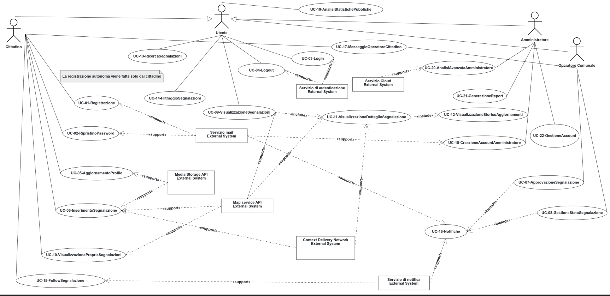

# 1) Use Case Diagram

Attach your use case diagram as an image under `../data/img/` and link it here:

# 2) Use Case Narratives
Annotazioni:
- 'Utente' comprende cittadino, operatore comunale e amministratore.
- I casi d'uso che hanno come Primary Actor 'Amministratore' o 'Operatore Comunale' richiedono sempre che l'utente sia autenticato, cioè che abbia completato il caso d'uso UC-03-Login. 
  
| Use Case||
|:----------------------------|:-----------------------------------------------------------------------------------------------------------------------------------------------|
| **ID**   | UC-01-Registrazione|
| **Scope**| Sistema web Participium.|
| **Level** | User goal.|
| **Intention in Context**    | Creare un nuovo account utente sulla piattaforma fornendo dati identificativi.|
| **Primary actor**           | Cittadino.|
| **Supporting actors**       | Servizio mail (IF-07).|
| **Stakeholders' interests** | Cittadino: ottenere l'accesso per effettuare segnalazioni e comunicare con gli operatori.   Comune di Torino: avere utenti univoci e verificati. |
| **Precondition**            |-|
| **Minimum guarantees**      | Nessun account duplicato viene creato. |
| **Success guarantees**      | Viene creato un account attivo dopo la verifica dell'email.|
| **Trigger**|-|
| **Main success scenario**   | 1. Il cittadino chiede di registrarsi.   2. Il sistema mostra il modulo di registrazione ([FR-1](./02_RequirementsEngineering.md#6-functional-requirements-fr)).   3. Il cittadino compila il modulo.   4. Il cittadino conferma la registrazione.   5. Il sistema crea l'account e invia una mail con il link di verifica ([FR-1.2](./02_RequirementsEngineering.md#6-functional-requirements-fr)).    6. Il cittadino accede alla propria email e verifica l'account cliccando il link.   7. Il sistema attiva l'account e mostra un messaggio di conferma; il caso d'uso termina con successo.|
| **Extensions**              | 4a. Username o email già presente.   &nbsp;&nbsp;&nbsp;&nbsp;4a.1 Il sistema segnala il conflitto; il caso d'uso riprende dal punto 3.   4b. La password non soddisfa i criteri di sicurezza. ([FR-1.1](./02_RequirementsEngineering.md#6-functional-requirements-fr))   &nbsp;&nbsp;&nbsp;&nbsp;4b.1 Il sistema segnala l'errore; il caso d'uso riprende dal punto 3.   6a. Link di verifica scaduto.  &nbsp;&nbsp;&nbsp;&nbsp;6a.1 Il sistema permette di richiedere un nuovo link; il caso d'uso riprende dal punto 6.|

| Use Case||
|:----------------------------|:-----------------------------------------------------------------------------------------------------------------------------------------------------------------------|
| **ID**                      | UC-02-RipristinoPassword|
| **Scope**                   | Sistema web Participium.|
| **Level** | User goal.|
| **Intention in Context**    | Ripristinare la password smarrita.|
| **Primary actor**           | Cittadino.|
| **Supporting actors**       | Servizio mail (IF-07)|
| **Stakeholders' interests** | Cittadino: recuperare l'accesso autonomamente.|
| **Precondition**            | L'account deve essere già stato verificato.|
| **Minimum guarantees**      | Il ripristino fallisce e la password rimane invariata.|
| **Success guarantees**      | La password viene aggiornata con successo.|
| **Trigger**| -|
| **Main success scenario**   | 1. Il cittadino chiede di ripristinare la password ([FR-3](./02_RequirementsEngineering.md#6-functional-requirements-fr)).     2. Il cittadino inserisce la propria email.    3. Il sistema invia una email contenente un link di ripristino monouso.     4. Il cittadino apre il link di ripristino.      5. Il sistema mostra il modulo per la nuova password.     6. Il cittadino inserisce e conferma la nuova password.     7. Il sistema valida la nuova password e aggiorna il database.; il caso d'uso termina con successo.                                                          |
| **Extensions**              | 2a. L'email non è associata a nessun account attivo.     &nbsp;&nbsp;&nbsp;&nbsp;2a.1 Il sistema avvisa che l'email non è registrata; il caso riprende dal punto 2.          5a. Link invalido/scaduto.     &nbsp;&nbsp;&nbsp;&nbsp;5a.1 Il sistema informa il cittadino dell'impossibilità di procedere; il caso d'uso termina con fallimento.    7a. La password non rispetta i requisiti minimi di sicurezza ([FR-1.1](./02_RequirementsEngineering.md#6-functional-requirements-fr)).   &nbsp;&nbsp;&nbsp;&nbsp;7a.1 Il sistema segnala l'errore; il caso d'uso riprende dal punto 6. |

| Use Case||
|:----------------------------|:--------------------------------------------------------------------------------------------------------------------------------------------------------------------------------------------------------------|
| **ID**| UC-03-Login|
| **Scope**| Sistema web Participium.|
| **Level** | User goal.|
| **Intention in Context**    | Accedere al sistema per usufruire delle funzionalità riservate agli utenti registrati.|
| **Primary actor**           | Utente|
| **Supporting actors**       | Servizio di autenticazione (IF-09).|
| **Stakeholders' interests** | Comune di Torino: garantire ai cittadini accessi autorizzati e protetti.   Utente: accedere in sicurezza ai propri account. |
| **Precondition**| L'utente deve aver completato la registrazione (UC-01-Registrazione).|
| **Minimum guarantees**|-|
| **Success guarantees**      | L'utente è autenticato e riceve i permessi corrispondenti al proprio ruolo.|
| **Trigger**|-|
| **Main success scenario**   | 1. L'utente chiede di effettuare il login.    2. Il sistema mostra il form di login ([FR-2](./02_RequirementsEngineering.md#6-functional-requirements-fr)).   3. L'utente inserisce le proprie credenziali.   4. Il sistema valida le credenziali e verifica che l'account sia attivo.  5. Il sistema autentica l'utente e assegna i permessi dovuti; il caso d'uso termina con successo.|
| **Extensions**              | 3a. L'utente annulla l'operazione.  &nbsp;&nbsp;&nbsp;&nbsp;3a.1 Il sistema interrompe il processo; il caso d'uso termina con fallimento.  3b. L'utente chiede di resettare la password.   &nbsp;&nbsp;&nbsp;&nbsp;3b.1 Il sistema avvia UC-02-RipristinoPassword   4a. Le credenziali inserite sono errate.   &nbsp;&nbsp;&nbsp;&nbsp;4a.1 Il sistema mostra errore; il caso riprende dal punto 2.   4b. L'account del cittadino non ha l'email verificata.   &nbsp;&nbsp;&nbsp;&nbsp;4b.1 Il sistema avvisa l'utente della necessità di confermare l'indirizzo email e il caso d'uso riprende dal punto 2.   4c. L'account è disabilitato.   &nbsp;&nbsp;&nbsp;&nbsp;4c.1 Il sistema mostra un messaggio di errore; il caso d'uso riprende dal punto 2.|

| Use Case||
|:----------------------------|:-----------------------------------------------------------------------------------------------------------------------|
| **ID**   | UC-04-Logout|
| **Scope**     | Sistema web Participium.|
| **Level** | User goal.|
| **Intention in Context**    | Terminare la sessione in sicurezza. |
| **Primary actor**           | Utente|
| **Supporting actors**       | Servizio di autenticazione (IF-09) |
| **Stakeholders' interests** | Utente: Proteggere l'account su dispositivi condivisi. |
| **Precondition**            | L'utente deve essere autenticato (UC-03-Login). |
| **Minimum guarantees**      | - |
| **Success guarantees**      | La sessione viene invalidata e l'accesso protetto revocato. |
| **Trigger**                 | - |
| **Main success scenario**   | 1. L'utente chiede di effettuare il logout.   2. Il sistema invalida la sessione lato server ([FR-4](./02_RequirementsEngineering.md#6-functional-requirements-fr)).    3. Il sistema reindirizza l'utente alla home page pubblica; il caso d'uso termina con successo.                        |
| **Extensions**              | 2a. Errore di invalidazione.    &nbsp;&nbsp;&nbsp;&nbsp;2a.1 Il sistema forza la chiusura lato client; il caso d'uso termina con successo.             |

| Use Case||
|:----------------------------|:------------------------------------------------------------------------------------------------------------------------------------------------------------------------|
| **ID**                      | UC-05-AggiornamentoProfilo |
| **Scope**                   | Sistema web Participium |
| **Level**                   | User goal |
| **Intention in Context**    | Aggiornare i dati personali, caricare una foto profilo e gestire le preferenze di notifica.|
| **Primary actor**           | Cittadino|
| **Supporting actors**       | Media Storage (IF-05) |
| **Stakeholders' interests** | Cittadino: Personalizzare la propria esperienza e gestire la privacy.|
| **Precondition**            | Il cittadino deve essere autenticato (UC-03-Login).|
| **Minimum guarantees**      | Le modifiche non vengono salvate e il profilo rimane invariato.|
| **Success guarantees**      | Il profilo e le preferenze vengono aggiornati correttamente.|
| **Trigger**                 |- |
| **Main success scenario**   | 1. Il cittadino chiede di modificare il proprio profilo.   2. Il sistema mostra i dati correnti, la foto profilo (se presente) e le preferenze per le notifiche ([FR-5](./02_RequirementsEngineering.md#6-functional-requirements-fr), [FR-5.1](./02_RequirementsEngineering.md#6-functional-requirements-fr)).    3. Il cittadino modifica i dati desiderati e li conferma.   4. Il sistema valida i dati e aggiorna il database.   5. Il sistema mostra il profilo aggiornato; il caso d'uso termina con successo.|
| **Extensions**              | 3a. Il cittadino annulla la modifica.  &nbsp;&nbsp;&nbsp;&nbsp; 3a.1 Il sistema non salva le modifiche; il caso d'uso termina con fallimento.   4a. I dati non soddisfano i criteri di validità;   &nbsp;&nbsp;&nbsp;&nbsp; 4a.1 Il sistema mostra un messaggio di errore e il caso d'uso riprende dal punto 3.   4b. Errore di connessione al database.   &nbsp;&nbsp;&nbsp;&nbsp; 4b.1 Il sistema mostra un messaggio di errore tecnico; il caso d'uso termina con fallimento.|

| Use Case                    |                                                                                                                                                                                                                                                                                                                                                                                                                                                                                                                                                                                                                                                                                                                                                                                                                                                          |
|:----------------------------|:---------------------------------------------------------------------------------------------------------------------------------------------------------------------------------------------------------------------------------------------------------------------------------------------------------------------------------------------------------------------------------------------------------------------------------------------------------------------------------------------------------------------------------------------------------------------------------------------------------------------------------------------------------------------------------------------------------------------------------------------------------------------------------------------------------------------------------------------------------|
| **ID**                      | UC-06-InserimentoSegnalazione                                                                                                                                                                                                                                                                                                                                                                                                                                                                                                                                                                                                                                                                                                                                                                                                                            |
| **Scope**                   | Sistema web Participium.                                                                                                                                                                                                                                                                                                                                                                                                                                                                                                                                                                                                                                                                                                                                                                                                                                 |
| **Level**                   | User goal.                                                                                                                                                                                                                                                                                                                                                                                                                                                                                                                                                                                                                                                                                                                                                                                                                                               |
| **Intention in Context**    | Inviare una segnalazione geolocalizzata di un disservizio urbano al Comune di Torino.                                                                                                                                                                                                                                                                                                                                                                                                                                                                                                                                                                                                                                                                                                                                                                    |
| **Primary actor**           | Cittadino                                                                                                                                                                                                                                                                                                                                                                                                                                                                                                                                                                                                                                                                                                                                                                                                                                                |
| **Supporting actors**       | Map Service API (IF-03), Media Storage (IF-05).                                                                                                                                                                                                                                                                                                                                                                                                                                                                                                                                                                                                                                                                                                                                                                                                          |
| **Stakeholders' interests** | Cittadino: comunicare efficacemente il problema riscontrato, garantire la propria privacy (anonimato pubblico), assicurarsi che la segnalazione venga ricevuta. Comune di Torino: ricevere segnalazioni accurate e geolocalizzate con evidenze visive per ottimizzare gli interventi.                                                                                                                                                                                                                                                                                                                                                                                                                                                                                                                                                                 |
| **Precondition**            | L'utente deve essere autenticato (UC-03-Login).                                                                                                                                                                                                                                                                                                                                                                                                                                                                                                                                                                                                                                                                                                                                                                                                          |
| **Minimum guarantees**      | Nessuna segnalazione viene creata se il processo viene interrotto.                                                                                                                                                                                                                                                                                                                                                                                                                                                                                                                                                                                                                                                                                                                                                                                       |
| **Success guarantees**      | Viene creata una segnalazione con stato "Pending Approval", le foto vengono archiviate, la posizione registrata e il cittadino riceve conferma visiva.                                                                                                                                                                                                                                                                                                                                                                                                                                                                                                                                                                                                                                                                                                   |
| **Trigger**                 | -                                                                                                                                                                                                                                                                                                                                                                                                                                                                                                                                                                                                                                                                                                                                                                                                                                                        |
| **Main success scenario**   | 1. Il cittadino chiede di inserire una nuova segnalazione.    2. Il sistema mostra la mappa e il modulo di inserimento.    3. Il cittadino fornisce i dettagli e la geolocalizzazione del disservizio. ([FR-6](./02_RequirementsEngineering.md#6-functional-requirements-fr) , [FR-6.2](./02_RequirementsEngineering.md#6-functional-requirements-fr)).   4. Il cittadino carica da 1 a 3 foto relative alla segnalazione.   5. Il cittadino seleziona opzionalmente l'anonimato pubblico ([FR-6.1](./02_RequirementsEngineering.md#6-functional-requirements-fr)).   6. Il cittadino conferma l'invio della segnalazione.   7. Il sistema valida i dati, carica le immagini sul Media Storage  e salva la segnalazione.   8. Il sistema assegna alla segnalazione lo stato "Pending Approval"; il caso d'uso termina con successo. |
| **Extensions**              | 2a. Non è possibile visualizzare correttamente la mappa. &nbsp;&nbsp;&nbsp;&nbsp;2a.1 Il sistema avvisa Il cittadino e il caso d'uso termina con fallimento.  3a. Il cittadino seleziona una posizione non valida (fuori dai confini di Torino). &nbsp;&nbsp;&nbsp;&nbsp;3a.1 Il sistema segnala l'errore e impedisce la selezione; il caso d'uso riprende dal punto 3.    7a. L'utente non ha inserito tutti i dati necessari. &nbsp;&nbsp;&nbsp;&nbsp;7a.1 Il sistema evidenzia i campi mancanti; il caso d'uso riprende dal punto 3.   7b. Il cittadino non ha caricato alcuna foto. &nbsp;&nbsp;&nbsp;&nbsp;7b.1 Il sistema mostra un messaggio di errore; il caso d'uso riprende dal punto 4.                                                                                                                                  |

| Use Case||
|:----------------------------|:-----------------------------------------------------------------------------------------------------------------------------------------------------------------------------------------------------------------------------------------------------------------------------------------------------------------------------------------------------------------------------------------------------------------------------------|
| **ID** | UC-07-ApprovazioneSegnalazione|
| **Scope** | Sistema web Participium.|
| **Level** | User goal.|
| **Intention in Context** | Validare una segnalazione in stato "Pending approval" per renderla visibile e assegnarla agli uffici competenti.|
| **Primary actor** | Operatore Comunale.|
| **Supporting actors** | - |
| **Stakeholders' interests** | Cittadino: vedere la propria segnalazione validata e presa in carico.   Operatore Comunale: filtrare segnalazioni inappropriate o duplicate per ottimizzare le risorse e garantire l'accuratezza dei dati.|
| **Precondition** | La segnalazione deve esistere e deve essere in stato 'Pending approval'.|
| **Minimum guarantees** | Se l'approvazione fallisce, la segnalazione rimane in stato 'Pending approval' e non è visibile nel portale pubblico.|
| **Success guarantees** | La segnalazione viene approvata, lo stato aggiornato in 'Assigned' e resa pubblica.|
| **Trigger** | Un utente crea una segnalazione (UC-06-InserimentoSegnalazione).|
| **Main success scenario** | 1. L'operatore accede ai dettagli della segnalazione "Pending approval" tramite la dashboard.   2. L'operatore verifica la validità del contenuto e delle immagini.   3. L'operatore ritiene la segnalazione conforme e conferma l'approvazione [(FR-7)](./02_RequirementsEngineering.md#6-functional-requirements-fr).   4. Il sistema aggiorna lo stato nel database da 'Pending approval' a 'Assigned'; il caso d'uso termina con successo innescando "UC-16-Notifiche".|
| **Extensions** | 2a. L'operatore richiede chiarimenti al cittadino segnalante (UC-17-MessaggioOperatoreCittadino).   3a. L'operatore rifiuta la segnalazione perché non conforme o duplicata.   &nbsp;&nbsp;&nbsp;&nbsp;3a.1 L'operatore inserisce la motivazione obbligatoria [(FR-7.1)](./02_RequirementsEngineering.md#6-functional-requirements-fr).   &nbsp;&nbsp;&nbsp;&nbsp;3a.2 Il sistema aggiorna lo stato in 'Rejected'; il caso d'uso termina con fallimento innescando "UC-16-Notifiche". |

| Use Case||
|:----------------------------|:------------------------------------------------------------------------------------------------------------------------------------------------------------------------------------------------------------------------------------------------------------------------------------------------------------------------------------------------------------------------------------------------------------------------------------------------|
| **ID**| UC-08-GestioneStatoSegnalazione|
| **Scope**| Sistema web Participium.|
| **Level** | User goal.|
| **Intention in Context**    | Aggiornare lo stato di una segnalazione durante il processo di gestione comunale.|
| **Primary actor**| Operatore Comunale.|
| **Supporting actors**|- |
| **Stakeholders' interests** | Operatore Comunale: gestire il carico di lavoro, tracciare l'avanzamento degli interventi.   Cittadino: ricevere aggiornamenti trasparenti e tempestivi sulla risoluzione del problema.  Comune di Torino: monitorare l'efficienza degli uffici tecnici. |
| **Precondition**            | La segnalazione deve esistere nel sistema.|
| **Minimum guarantees**| Lo stato rimane invariato se l'aggiornamento fallisce.|
| **Success guarantees**| Lo stato della segnalazione è aggiornato, Il cittadino segnalante e i followers della seganalazione ricevono una notifica.|
| **Trigger**| -|
| **Main success scenario**   | 1. L'operatore chiede di modificare una segnalazione.   2. L'operatore assegna un nuovo stato alla segnalazione scegliendo tra quelli disponibili ([FR-8](./02_RequirementsEngineering.md#6-functional-requirements-fr)).   3. L'operatore inserisce opzionalmente un commento interno nel campo di testo.    4. L'operatore conferma l'aggiornamento di stato.   5. Il sistema valida il passaggio di stato, aggiorna il database e registra lo storico; il caso d'uso termina con successo innescando "UC-16-Notifiche".|
| **Extensions**              | 2a. La transizione di stato non è valida.   &nbsp;&nbsp;&nbsp;&nbsp;2a.1 Il sistema segnala l'errore e impedisce l'operazione; il caso d'uso riprende dal punto 2.   2b. La segnalazione è già stata completata (Resolved o Rejected). &nbsp;&nbsp;&nbsp;&nbsp;   &nbsp;&nbsp;&nbsp;&nbsp; 2b.1 Il sistema segnala l'errore e impedisce l'operazione; il caso d'uso riprende dal punto 2.   4a. Errore di connessione al database.   &nbsp;&nbsp;&nbsp;&nbsp;4a.1 Il sistema mostra un messaggio di errore; il caso d'uso termina con fallimento.|

| Use Case||
|:----------------------------|:----------------------------------------------------------------------------------------------------------------------------------------------------------------------------------------------------------------------------------------------------------------------------------------------------------------|
| **ID**                      | UC-09-VisualizzazioneSegnalazioni|
| **Scope**                   | Sistema web Participium.|
| **Level** | User goal.|
| **Intention in Context**    | Visualizzare le segnalazioni presenti sia sulla mappa che nella vista tabellare.|
| **Primary actor**           | Utente.|
| **Supporting actors**       | Map Service API (IF-04), Content Delivery Network (IF-06).|
| **Stakeholders' interests** | Utente: verificare se un problema è già stato segnalato, monitorare i disservizi nella città.   Comune di Torino: garantire trasparenza e ridurre segnalazioni duplicate. |
| **Precondition**            |-|
| **Minimum guarantees**      |-|
| **Success guarantees**      | L'utente visualizza le segnalazioni correttamente.|
| **Trigger**                 | -|
| **Main success scenario**   | 1. L'utente chiede di consultare le segnalazioni.   2. Il sistema carica la mappa con i pin geolocalizzati  e la lista delle segnalazioni.   3. L'utente visualizza le segnalazioni sulla mappa ([FR-10](./02_RequirementsEngineering.md#6-functional-requirements-fr)) e nella lista ([FR-11](./02_RequirementsEngineering.md#6-functional-requirements-fr)), visualizzandone titolo, categoria, stato e data. Il caso d'uso termina con successo.|
| **Extensions**              | 2a. Il sistema OpenStreetMap non è disponibile. &nbsp;&nbsp;&nbsp;&nbsp;2a.1 Il sistema avvisa l'utente e mostra solo la lista delle segnalazioni; il caso d'uso termina con successo.|

| Use Case||
|:----------------------------|:-----------------------------------------------------------------------------------------------------------------------------------------------------------------|
| **ID**| UC-10-VisualizzazioneProprieSegnalazioni|
| **Scope**| Sistema web Participium.|
| **Level** | User goal.|
| **Intention in Context**    | Visualizzare le segnalazioni del cittadino, consultare lo storico e lo stato attuale di tutte le segnalazioni da lui inviate.|
| **Primary actor**      | Cittadino.|
| **Supporting actors**       | Map Service API (IF-04).|
| **Stakeholders' interests** | Cittadino: verificare l'avanzamento dei propri ticket e avere uno storico personale.|
| **Precondition**            | Il cittadino deve essere autenticato (UC-03-Login).|
| **Minimum guarantees**      | Se non sono presenti segnalazioni, il sistema mostra un elenco vuoto senza errori.|
| **Success guarantees**      | Il cittadino visualizza l'elenco corretto delle proprie segnalazioni con i relativi stati aggiornati.|
| **Trigger**                 | -|
| **Main success scenario**   | 1. Il cittadino chiede di visualizzare le proprie segnalazioni.    2. Il sistema interroga il database per recuperare i record associati all'ID utente.     3. Il sistema mostra la lista delle segnalazioni o l'elenco vuoto ([FR-12](./02_RequirementsEngineering.md#6-functional-requirements-fr)); il caso d'uso termina con successo.                |
| **Extensions**              | 1a. Il sistema non riesce a recuperare i dati.     &nbsp;&nbsp;&nbsp;&nbsp;1a.1 Il sistema mostra un messaggio di errore; il caso d'uso termina con fallimento.|

| Use Case||
|:----------------------------|:-----------------------------------------------------------------------------------------------------------------------------------------------------------------------------------------|
| **ID**  | UC-11-VisualizzazioneDettaglioSegnalazione|
| **Scope**| Sistema web Participium.|
| **Level** | User goal.|
| **Intention in Context**    | Accedere alla scheda completa di una segnalazione per leggerne la descrizione, visualizzarne le foto e visualizzare lo storico degli aggiornamenti.|
| **Primary actor**           | Utente.|
| **Supporting actors**       | Map Service API (IF-04), Content Delivery Network (IF-06).|
| **Stakeholders' interests** | Utente: comprendere i dettagli di un problema specifico e seguire gli aggiornamenti di stato.||
| **Precondition**            |-|
| **Minimum guarantees**      |-|
| **Success guarantees**      | L'utente visualizza la pagina di dettaglio completa contenente i dati della segnalazione e le relative interazioni pubbliche.|
| **Trigger**                 |-|
| **Main success scenario**   | 1.  L'utente sta visualizzando l'elenco delle segnalazioni (UC-09-VisualizzazioneElencoSegnalazioni).   2. L'utente chiede di accedere ai dettagli di una segnalazione.     3. Il sistema recupera i dati associati alla segnalazione selezionata.     4. Il sistema mostra i dettagli della segnalazione ([FR-13](./02_RequirementsEngineering.md#6-functional-requirements-fr)); il caso d'uso termina con successo. |
| **Extensions**              | 2a. Il sistema non riesce a recuperare i dettagli della segnalazione.      &nbsp;&nbsp;&nbsp;&nbsp;2a.1 Il sistema mostra un messaggio di errore e il caso d'uso termina con un fallimento.|

| Use Case                    ||
|:----------------------------|:-------------------------------------------------------------------------------------------------------------------------------------------|
| **ID**                      | UC-12-VisualizzazioneStoricoAggiornamenti|
| **Scope**                   | Sistema web Participium.|
| **Level** | User goal.|
| **Intention in Context**    | Verificare lo storico degli stati di una segnalazione per monitorare la gestione del problema nel tempo.                                   |
| **Primary actor**           | Utente.|
| **Supporting actors**       |-|
| **Stakeholders' interests** | Utente: monitorare i progressi di una segnalazione nel tempo.   |
| **Precondition**            |-|
| **Minimum guarantees**      | Se il sistema non riesce a recuperare lo storico, l'utente visualizza comunque i dati correnti della segnalazione.|
| **Success guarantees**      | Il sistema mostra tutti i cambi di stato nel tempo per una segnalazione.|
| **Trigger**                 | -|
| **Main success scenario**   | 1. L'utente sta visualizzando i dettagli di una segnalazione (UC-11).   2. L'utente chiede di visualizzare lo storico degli aggiornamenti di una segnalazione.      3. Il sistema recupera dal database lo storico dei cambi di stato.   4. Il sistema mostra i cambi di stato e le relative date di cambiamento ([FR-13](./02_RequirementsEngineering.md#6-functional-requirements-fr)); il caso d'uso termina con successo.|
| **Extensions**              | 3a. Lo storico è vuoto.       &nbsp;&nbsp;&nbsp;&nbsp;3a.1 Il sistema mostra i dati correnti della segnalazione e il caso d'uso termina con successo.|

| Use Case||
|:----------------------------|:--------------------------------------------------------------------------------------------------------------------------------------------------------------------------------------------------------------------------------------------------------------------------------------|
| **ID** | UC-13-RicercaSegnalazioni|
| **Scope** | Sistema web Participium.|
| **Level** | User goal.|
| **Intention in Context** | Consultare segnalazioni specifiche tramite ricerca testuale.|
| **Primary actor** | Utente.|
| **Supporting actors** | -|
| **Stakeholders' interests** | Utente: trovare rapidamente le segnalazioni di proprio interesse.|
| **Precondition** | L'utente sta visualizzando l'elenco delle segnalazioni (UC-09 / UC-10)|
| **Minimum guarantees** | I filtri applicati non influenzano la persistenza dei dati nel database.|
| **Success guarantees** | L'utente visualizza l'elenco delle segnalazioni che corrispondono alla stringa inserita.|
| **Trigger** | -|
| **Main success scenario** | 1. L'utente effettua una ricerca testuale nella navigation bar del sito.   2. Il sistema interroga il database per ricercare le segnalazioni contenenti il testo inserito ([FR-11.1](./02_RequirementsEngineering.md#6-functional-requirements-fr)).   3. Il sistema aggiorna la visualizzazione mostrando i risultati; il caso d'uso termina con successo. |
| **Extensions** | 2a. Nessuna segnalazione soddisfa i criteri inseriti dall'utente.   &nbsp;&nbsp;&nbsp;&nbsp;2a.1 Il sistema mostra un risultato vuoto e il caso d'uso termina con fallimento.|

| Use Case|                                                                                                                                                                                                                                                                                                                                          |
|:----------------------------|:-----------------------------------------------------------------------------------------------------------------------------------------------------------------------------------------------------------------------------------------------------------------------------------------------------------------------------------------|
| **ID** | UC-14-FiltraggioSegnalazioni                                                                                                                                                                                                                                                                                                             |
| **Scope** | Sistema web Participium.                                                                                                                                                                                                                                                                                                                 |
| **Level** | User goal.                                                                                                                                                                                                                                                                                                                               |
| **Intention in Context** | Consultare segnalazioni specifiche tramite filtri (categoria, stato, periodo).                                                                                                                                                                                                                                                           |
| **Primary actor** | Utente.                                                                                                                                                                                                                                                                                                                                  |
| **Supporting actors** | -                                                                                                                                                                                                                                                                                                                                        |
| **Stakeholders' interests** | Utente: visualizzare segnalazioni filtrate e ordinate secondo le proprie volontà.   Comune di Torino: garantire una navigazione fluida tra le segnalazioni.                                                                                                                                                                           |
| **Precondition** | L'utente sta visualizzando l'elenco delle segnalazioni (UC-09 / UC-10)                                                                                                                                                                                                                                                                   |
| **Minimum guarantees** | I filtri applicati non influenzano la persistenza dei dati nel database.                                                                                                                                                                                                                                                                 |
| **Success guarantees** | L'utente visualizza un sottoinsieme di segnalazioni corrispondenti ai filtri selezionati.                                                                                                                                                                                                                                                |
| **Trigger** | -                                                                                                                                                                                                                                                                                                                                        |
| **Main success scenario** | 1. L'utente seleziona uno o più filtri.   2. Il sistema interroga il database e filtra le segnalazioni secondo i criteri impostati ([FR-11.2](./02_RequirementsEngineering.md#6-functional-requirements-fr)).   3. Il sistema aggiorna la visualizzazione mostrando solo i risultati filtrati; il caso d'uso termina con successo. |
| **Extensions** | 2a. Nessuna segnalazione soddisfa i criteri selezionati.   &nbsp;&nbsp;&nbsp;&nbsp;2a.1 Il sistema mostra un risultato vuoto; il caso d'uso termina con successo.                                                                                                                                                                     |

| Use Case||
|:----------------------------|:----------------------------------------------------------------------------------------------------------------------------------------------------------------------------------|
| **ID**| UC-15-FollowSegnalazione|
| **Scope**                   | Sistema web Participium.|
| **Level** | User goal.|
| **Intention in Context**    | Seguire una segnalazione esistente per ricevere aggiornamenti sulla sua evoluzione.                                                                                               |
| **Primary actor**           | Cittadino.|
| **Supporting actors**       | Servizio di Notifica (IF-07).|
| **Stakeholders' interests** | Cittadino: rimanere informato sugli sviluppi delle segnalazioni di interesse.|
| **Precondition**            | Il cittadino deve essere autenticato (UC-03-Login).   Il cittadino sta visualizzando il dettaglio di una segnalazione (UC-11-DettaglioSegnalazione)|
| **Minimum guarantees**      | -|
| **Success guarantees**      | Il sistema predispone l'invio di notifiche all'utente ad ogni cambio di stato della segnalazione seguita. |
| **Trigger**| -|
| **Main success scenario**   | 1. Il cittadino chiede di seguire una segnalazione ([FR-14](./02_RequirementsEngineering.md#6-functional-requirements-fr)).    2. Il sistema associa l'identificativo utente alla segnalazione nel database.     3. Il sistema conferma visivamente l'attivazione del follow; il caso d'uso termina con successo.                                                                                  |
| **Extensions**              | 1a. Il cittadino segue già la segnalazione, il sistema non duplica il follow e il caso d'uso termina con fallimento.|

| Use Case||
|:----------------------------|:--------------------------------------------------------------------------------------------------------------------------------------------------------------------------------------------------------------------------------------------------------------------|
| **ID** | UC-16-Notifiche|
| **Scope** | Sistema web Participium.|
| **Level** | Sub-function.|
| **Intention in Context** | Informare gli utenti in merito all'avanzamento di stato di una segnalazione seguita.|
| **Primary actor** | Operatore Comunale.|
| **Supporting actors** | Servizio di notifica (IF-07), Servizio mail (IF-07).|
| **Stakeholders' interests** | Cittadino: essere aggiornato tempestivamente sui cambiamenti delle segnalazioni seguite.   Operatore Comunale: comunicare automaticamente gli aggiornamenti senza interventi manuali aggiuntivi.                                       |
| **Precondition** |- |
| **Minimum guarantees** | Il sistema non invia comunicazioni se non ci sono utenti interessati o se le preferenze di notifica sono disabilitate (FR-6).|
| **Success guarantees** | L'utente riceve una notifica in piattaforma e via email.|
| **Trigger** | L'Operatore Comunale modifica lo stato di una segnalazione (UC-07 / UC-08).|
| **Main success scenario** | 1. Il sistema individua gli utenti interessati alla segnalazione (segnalante e follower).   2. Il sistema invia una notifica in piattaforma comunicando il nuovo stato ([FR-9](./02_RequirementsEngineering.md#6-functional-requirements-fr)).   3. Se previsto dalle preferenze, il sistema invia una mail informativa; il caso d'uso termina con successo. |
| **Extensions** | 3a. Il servizio mail non è temporaneamente raggiungibile.   &nbsp;&nbsp;&nbsp;&nbsp;3a.1 Il sistema mette la comunicazione in coda per un nuovo invio; il caso d'uso termina con fallimento.|

| Use Case||
|:----------------------------|:--------------------------------------------------------------------------------------------------------------------------------------------------------------------------------------------------------------------------------------------------------------------|
| **ID**| UC-17-MessaggioOperatoreCittadino|
| **Scope**                   | Sistema web Participium |
| **Level** | User goal |
| **Intention in Context**    | Scambio di messaggi diretti tra operatore e cittadino su una segnalazione. |
| **Primary actor**           | Operatore Comunale / Cittadino |
| **Supporting actors**       | Cittadino / Operatore Comunale |
| **Stakeholders' interests** | Operatore Comunale: Richiedere chiarimenti su segnalazioni ricevute.   Cittadino: Fornire ulteriori dettagli per facilitare l'intervento; chiedere informazioni sull'avanzamento.   Comune di Torino:  |
| **Precondition**            | Entrambi gli attori devono essere autenticati (UC-03-Login)|
| **Minimum guarantees**      |-|
| **Success guarantees**      | Il messaggio viene recapitato al destinatario. |
| **Trigger**                 | - |
| **Main success scenario**   | 1. L'utente seleziona l'opzione per visualizzare i messaggi all'interno del dettaglio di una segnalazione.     2. Il sistema mostra la cronologia dei messaggi scambiati ([FR-15](./02_RequirementsEngineering.md#6-functional-requirements-fr)).    3. L'utente scrive un nuovo testo del messaggio e lo invia.    4. Il sistema salva il messaggio associandolo univocamente alla segnalazione; il caso d'uso termina con successo.                                 |
| **Extensions**              | 3a. Il testo del messaggio è vuoto.   &nbsp;&nbsp;&nbsp;&nbsp;3a.1 Il sistema impedisce l'invio; il caso riprende dal punto 2. |

| Use Case                    ||
|:----------------------------|:------------------------------------------------------------------------------------------------------------------------------------------------------------------------------------------------------------------------------|
| **ID**                      | UC-18-CreazioneAccountAmministratore |
| **Scope**                   | Sistema web Participium |
| **Level** | User goal |
| **Intention in Context**    | Creare account per amministratori o operatori.|
| **Primary actor**           | Amministratore  |
| **Supporting actors**       | Servizio mail (IF-07) |
| **Stakeholders' interests** | Amministratore : gestire il team tecnico e operativo fornendo accesso ai sistemi. |
| **Precondition**            | -|
| **Minimum guarantees**      |-|
| **Success guarantees**      | Viene creato il nuovo account e inviata la mail con le informazioni di accesso. |
| **Trigger**                 | - |
| **Main success scenario**   | 1. L'amministratore chiede di creare un nuovo utente.   2. L'amministratore inserisce i dati del nuovo collaboratore.            3. L'amministratore seleziona i permessi specifici (Amministratore o Operatore) ([FR-19](./02_RequirementsEngineering.md#6-functional-requirements-fr), [FR-20](./02_RequirementsEngineering.md#6-functional-requirements-fr)).   4. Il sistema valida i dati e aggiorna il database.   5. Il sistema invia automaticamente le credenziali d'accesso via mail; il caso d'uso termina con successo.                                                           |
| **Extensions**              | 4a. L'email inserita è già presente nel database o non è valida.               &nbsp;&nbsp;&nbsp;&nbsp;4a.1 Il sistema nega la creazione mostrando errore; il caso d'uso riprende dal punto 2. |

| Use Case||
|:----------------------------|:--------------------------------------------------------------------------------------------------------------------------------------------------------------------------------------------------------------------------------------------------------------------------------------------------------|
| **ID** | UC-19-AnalisiStatistichePubbliche|
| **Scope** | Sistema web Participium.|
| **Level** | User goal.|
| **Intention in Context** | Consultare dati aggregati e trend generali per comprendere lo stato dei problemi urbani in città.|
| **Primary actor** | Utente.|
| **Supporting actors** | -|
| **Stakeholders' interests** | Utente: avere una visione d'insieme dei disservizi più comuni nel proprio comune.   Amministratore: monitorare l'andamento delle segnalazioni per cercare di migliorare il servizio.|
| **Precondition** | Il database contiene segnalazioni pubblicate e approvate.|
| **Minimum guarantees** | Se l'elaborazione fallisce, il sistema mostra un messaggio di errore e non aggiorna i dati visualizzati.|
| **Success guarantees** | L'utente visualizza grafici basati su categorie e trend temporali.|
| **Trigger** | -|
| **Main success scenario** | 1. L'utente chiede di visualizzare le statistiche pubbliche.   2. Il sistema interroga il database e mostra le statistiche pubbliche richieste ([FR-16](./02_RequirementsEngineering.md#6-functional-requirements-fr)).   3. L'utente applica filtri ai dati ottenuti.   4. Il sistema aggiorna dinamicamente la visualizzazione; il caso d'uso termina con successo. |
| **Extensions** | 3a.  L'elaborazione dei dati da parte del sistema fallisce.   &nbsp;&nbsp;&nbsp;&nbsp;3a.1 Il sistema mostra un messaggio di errore, il caso d'uso riprende dal punto 2.|

| Use Case|                                                                                                                                                                                                                                                                                                                                                                       |
|:----------------------------|:----------------------------------------------------------------------------------------------------------------------------------------------------------------------------------------------------------------------------------------------------------------------------------------------------------------------------------------------------------------------|
| **ID**| UC-20-AnalisiAvanzataAmministratore                                                                                                                                                                                                                                                                                                                                   |
| **Scope**| Sistema web Participium.                                                                                                                                                                                                                                                                                                                                              |
| **Level** | User goal.                                                                                                                                                                                                                                                                                                                                                            |
| **Intention in Context**    | Analizzare dati complessi per monitorare l'efficienza del servizio.                                                                                                                                                                                                                                                                                                   |
| **Primary actor**           | Amministratore.                                                                                                                                                                                                                                                                                                                                                       |
| **Supporting actors**       | -                                                                                                                                                                                                                                                                                                                                                                     |
| **Stakeholders' interests** | Amministratore: analizzare l'efficienza del servizio e identificare eventuali criticità.   Comune di Torino: disporre di reportistica dettagliata per migliorare il servizio.                                                                                                                                                                                      |
| **Precondition**            | -                                                                                                                                                                                                                                                                                                                                                                     |
| **Minimum guarantees**      | Se l'elaborazione fallisce, il sistema mostra un messaggio di errore e non aggiorna i dati visualizzati.                                                                                                                                                                                                                                                              |
| **Success guarantees**      | Il sistema genera report e grafici basati su metriche private non accessibili al pubblico.                                                                                                                                                                                                                                                                            |
| **Trigger**| -                                                                                                                                                                                                                                                                                                                                                                     |
| **Main success scenario**   | 1. L'amministratore chiede di effettuare un'analisi avanzata.      2. L'amministratore seleziona i parametri da considerare nell'analisi.      3. Il sistema elabora i dati tramite query.     4. Il sistema mostra tabelle e  grafici avanzati ([FR-17](./02_RequirementsEngineering.md#6-functional-requirements-fr)); il caso d'uso termina con successo. |
| **Extensions**              | 3a. L'elaborazione dei dati da parte del sistema fallisce.    &nbsp;&nbsp;&nbsp;&nbsp;3a.1 Il sistema mostra un messaggio di errore, il caso d'uso riprende dal punto 2.                                                                                                                                                                                           |

| Use Case                    ||
|:----------------------------|:----------------------------------------------------------------------------------------------------------------------------------------------------------------------------------------------|
| **ID**                      | UC-21-GenerazioneReport |
| **Scope**                   | Sistema web Participium |
| **Level** | User goal |
| **Intention in Context**    | Estrarre dati statistici avanzati. |
| **Primary actor**           | Amministratore  |
| **Supporting actors**       | - |
| **Stakeholders' interests** | Amministratore : fornire indicazioni sull'andamento dell'attività.   Comune di Torino: ricevere report dettagliati per monitorare l'efficienza di risoluzione dei problemi. |
| **Precondition**            | - |
| **Minimum guarantees**      | - |
| **Success guarantees**      | Il report viene generato ed esportato in formato conforme. |
| **Trigger**                 | - |
| **Main success scenario**   | 1. L'amministratore chiede di generare statistiche e report dalla dashboard amministratore.    2. Il sistema propone i filtri di aggregazione.    3. L'amministratore seleziona i parametri per la generazione di dati privati.    4. Il sistema genera e mostra grafici interattivi.        5. L'amministratore chiede di esportare il report in formato CSV. ([FR-18](./02_RequirementsEngineering.md#6-functional-requirements-fr)).    6. Il sistema genera il file conforme e avvia il download; il caso d'uso termina con successo.    |
| **Extensions**              | 3a. Non autorizzato.      &nbsp;&nbsp;&nbsp;&nbsp;3a.1 Il sistema nega l'accesso ai dati sensibili; il caso d'uso termina con fallimento. |

| Use Case                    ||
|:----------------------------|:----------------------------------------------------------------------------------------------------------------------------------------------------------------------------------------------|
| **ID**                      | UC-22-GestioneAccount |
| **Scope**                   | Sistema web Participium |
| **Level** | User goal |
| **Intention in Context**    | Sospendere, bannare, limitare o riattivare l'accesso a un account utente. |
| **Primary actor**           | Amministratore  |
| **Supporting actors**       |-|
| **Stakeholders' interests** | Amministratore: gestire gli account utente   Comune di Torino: monitorare l'utilizzo della piattaforma da parte degli utenti |
| **Precondition**            | - |
| **Minimum guarantees**      | - |
| **Success guarantees**      | I permessi dell'account utente vengono aggiornati con successo. |
| **Trigger**                 | - |
| **Main success scenario**   |1. L'amministratore chiede di modificare i permessi di un utente ([FR-21](./02_RequirementsEngineering.md#6-functional-requirements-fr)).   2.  Il sistema modifica i permessi dell'account utente e notifica l'amministratore; il caso d'uso termina con successo. |
| **Extensions**              | 2a. L'amministratore annulla l'operazione; il caso d'uso termina con fallimento.   2b. L'utente è già sospeso   &nbsp;&nbsp;&nbsp;&nbsp; 2b.1 Il sistema mostra un messaggio di errore; il caso d'uso termina con fallimento. |
     

# Traceability Table

| UC ID | REQ ID|
|:------|:-------------------------------------------------------------------------------------------------------------------------------------------------------------------------------------------------------------------------------------------------------------------------------------------------------------------------------------------------------------------------------------------------------------------------------------------|
| UC-01 | [FR-1](./02_RequirementsEngineering.md#6-functional-requirements-fr), [FR-1.1](./02_RequirementsEngineering.md#6-functional-requirements-fr), [FR-1.2](./02_RequirementsEngineering.md#6-functional-requirements-fr), [NFR-11](./02_RequirementsEngineering.md#7-non-functional-requirements-nfr)|
| UC-02 | [FR-3](./02_RequirementsEngineering.md#6-functional-requirements-fr), [FR-1.1](./02_RequirementsEngineering.md#6-functional-requirements-fr), [NFR-11](./02_RequirementsEngineering.md#7-non-functional-requirements-nfr)|
| UC-03 | [FR-2](./02_RequirementsEngineering.md#6-functional-requirements-fr), [NFR-12](./02_RequirementsEngineering.md#7-non-functional-requirements-nfr)|
| UC-04 | [FR-4](./02_RequirementsEngineering.md#6-functional-requirements-fr)|
| UC-05 | [FR-5](./02_RequirementsEngineering.md#6-functional-requirements-fr), [FR-5.1](./02_RequirementsEngineering.md#6-functional-requirements-fr), [NFR-03](./02_RequirementsEngineering.md#7-non-functional-requirements-nfr)|
| UC-06 | [FR-6](./02_RequirementsEngineering.md#6-functional-requirements-fr), [FR-6.1](./02_RequirementsEngineering.md#6-functional-requirements-fr), [FR-6.2](./02_RequirementsEngineering.md#6-functional-requirements-fr), [NFR-01](./02_RequirementsEngineering.md#7-non-functional-requirements-nfr), [NFR-02](./02_RequirementsEngineering.md#7-non-functional-requirements-nfr), [NFR-04](./02_RequirementsEngineering.md#7-non-functional-requirements-nfr), [NFR-07](./02_RequirementsEngineering.md#7-non-functional-requirements-nfr), [NFR-08](./02_RequirementsEngineering.md#7-non-functional-requirements-nfr)|
| UC-07 | [FR-7](./02_RequirementsEngineering.md#6-functional-requirements-fr), [FR-7.1](./02_RequirementsEngineering.md#6-functional-requirements-fr), [FR-8](./02_RequirementsEngineering.md#6-functional-requirements-fr)|
| UC-08 | [FR-8](./02_RequirementsEngineering.md#6-functional-requirements-fr), [NFR-07](./02_RequirementsEngineering.md#7-non-functional-requirements-nfr)|
| UC-09 | [FR-10](./02_RequirementsEngineering.md#6-functional-requirements-fr), [FR-11](./02_RequirementsEngineering.md#6-functional-requirements-fr), [NFR-07](./02_RequirementsEngineering.md#7-non-functional-requirements-nfr), [NFR-09](./02_RequirementsEngineering.md#7-non-functional-requirements-nfr)|
| UC-10 | [FR-12](./02_RequirementsEngineering.md#6-functional-requirements-fr)|
| UC-11 | [FR-13](./02_RequirementsEngineering.md#6-functional-requirements-fr), [NFR-04](./02_RequirementsEngineering.md#7-non-functional-requirements-nfr), [NFR-06](./02_RequirementsEngineering.md#7-non-functional-requirements-nfr)|
| UC-12 | [FR-13](./02_RequirementsEngineering.md#6-functional-requirements-fr)|
| UC-13 | [FR-11.1](./02_RequirementsEngineering.md#6-functional-requirements-fr)|
| UC-14 | [FR-11.2](./02_RequirementsEngineering.md#6-functional-requirements-fr), [FR-11.3](./02_RequirementsEngineering.md#6-functional-requirements-fr)|
| UC-15 | [FR-14](./02_RequirementsEngineering.md#6-functional-requirements-fr)|
| UC-16 | [FR-9](./02_RequirementsEngineering.md#6-functional-requirements-fr), [NFR-11](./02_RequirementsEngineering.md#7-non-functional-requirements-nfr)|
| UC-17 | [FR-15](./02_RequirementsEngineering.md#6-functional-requirements-fr), [NFR-01](./02_RequirementsEngineering.md#7-non-functional-requirements-nfr), [NFR-02](./02_RequirementsEngineering.md#7-non-functional-requirements-nfr)|
| UC-18 | [FR-19](./02_RequirementsEngineering.md#6-functional-requirements-fr), [FR-20](./02_RequirementsEngineering.md#6-functional-requirements-fr), [NFR-03](./02_RequirementsEngineering.md#7-non-functional-requirements-nfr), [NFR-11](./02_RequirementsEngineering.md#7-non-functional-requirements-nfr)|
| UC-19 | [FR-16](./02_RequirementsEngineering.md#6-functional-requirements-fr), [NFR-06](./02_RequirementsEngineering.md#7-non-functional-requirements-nfr)|
| UC-20 | [FR-17](./02_RequirementsEngineering.md#6-functional-requirements-fr), [NFR-05](./02_RequirementsEngineering.md#7-non-functional-requirements-nfr)|
| UC-21 | [FR-18](./02_RequirementsEngineering.md#6-functional-requirements-fr), [NFR-14](./02_RequirementsEngineering.md#7-non-functional-requirements-nfr)|
| UC-22 | [FR-21](./02_RequirementsEngineering.md#6-functional-requirements-fr)|