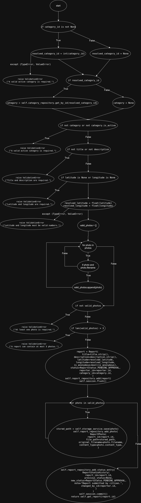
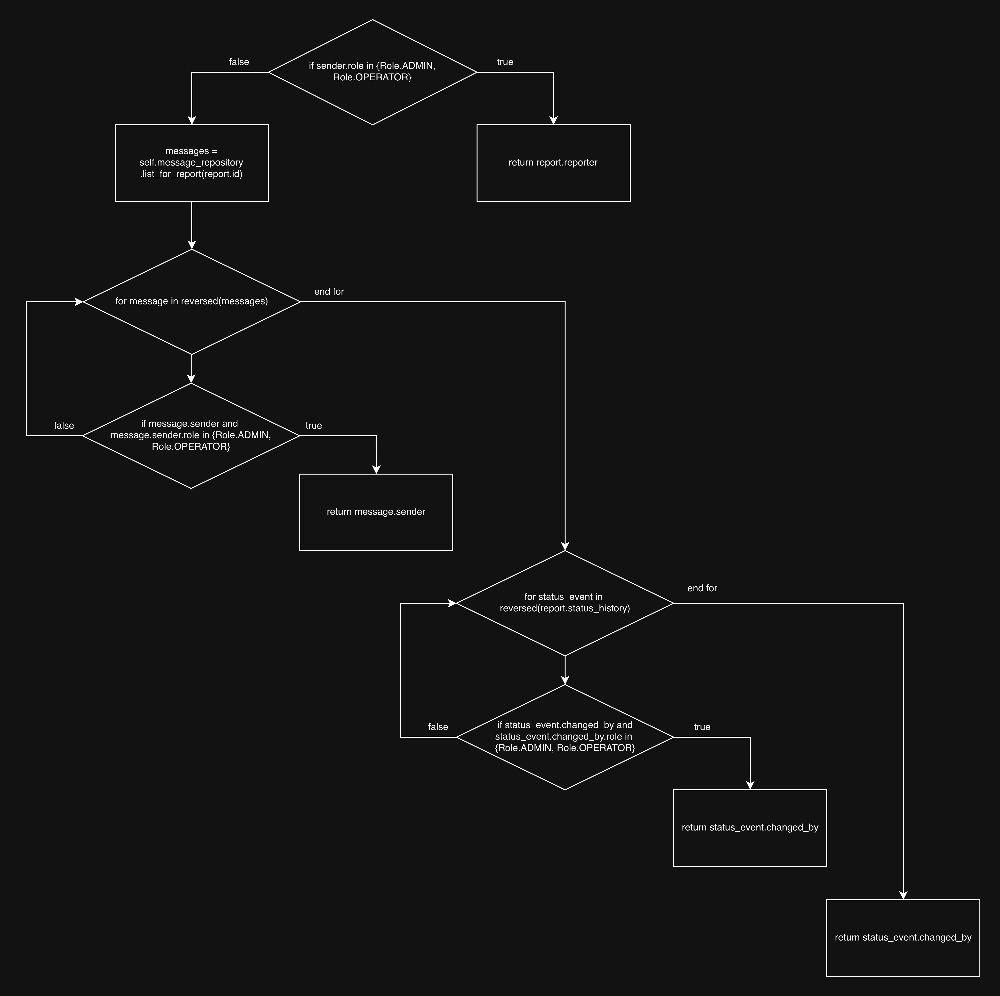
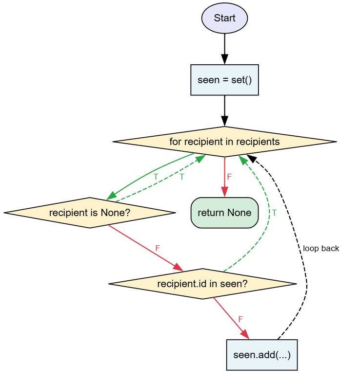
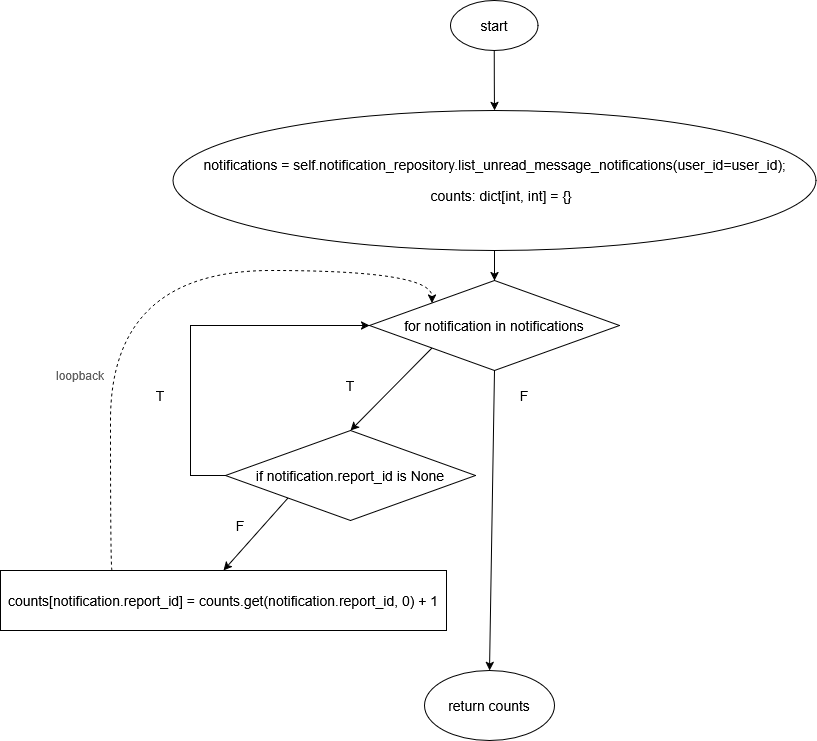

## 1 `ReportService.create_report`

### Control Flow Graph

- 

### Atomic Conditions
- C1: category_id is not None 
- C2: resolved_category_id
- C3: not category
- C4: not category.is_active
- C5: not title 
- C6: not description
- C7: latitude is None
- C8: longitude is None
- C9: for photo (esistono ancora photo in photos)
- C10: photo
- C11: photo.filename
- C12: not valid_photos
- C13: len(valid_photos) > 3
- C14: for photo (esistono ancora photo in valid_photos)

### Structural Lower Bound
La funzione create_report produce 8 esiti mutualmente esclusivi, 7 corrispondenti ad eccezioni di tipo ValidationError e 1 return finale di successo. Ogni esecuzione del test restituisce uno di questi esiti, quindi lo structural lower bound è 8.

### Node Coverage
Nota: per p si intende una foto con fileName invece per p_no_fn una foto senza fileName
| ID   | `reporter` |`category_id`| `title`| `description` | `latitude` | `longitude` | `photos`| `is_anonymous` | Outcome atteso |
|------|---------------|---------------|---------------|---------------|---------------|---------------|---------------|---------------|------------------------------|
|CRN-01| reporter1(id=1) | "uno" | "Buca profonda" | "Si segnala una buca di ampie dimensioni" | 45.4642 | 9.1900 | [p,p] | True | ValidationError("A valid active category is required.") |
|CRN-02| reporter1(id=1) | None | "Buca profonda" | "Si segnala una buca di ampie dimensioni" | 45.4642 | 9.1900 | [p,p]| True | ValidationError ("A valid active category is required.") |
|CRN-03| reporter1(id=1) | 1 |  None  | "Si segnala una buca di ampie dimensioni" | 45.4642 | 9.1900 | [p,p] | True | ValidationError ("Title and description are required.") |
|CRN-04| reporter1(id=1) | 1 |  "Buca profonda"  | "Si segnala una buca di ampie dimensioni" | None | 9.1900 | [p,p]| True | ValidationError ("Latitude and longitude are required.") |
|CRN-05| reporter1(id=1) | 1 |  "Buca profonda"  | "Si segnala una buca di ampie dimensioni" | "Quaranta" | 9.1900 | [p,p] | True | ValidationError ("Latitude and longitude must be valid numbers.") |
|CRN-06| reporter1(id=1) | 1 |  "Buca profonda"  | "Si segnala una buca di ampie dimensioni" | 45.4642 | 9.1900 | [] | True | ValidationError ("At least one photo is required.") |
|CRN-07| reporter1(id=1) | 1 |  "Buca profonda"  | "Si segnala una buca di ampie dimensioni" | 45.4642 | 9.1900 | [p, None, p_no_fn, p, p, p] | True | ValidationError ("A report can contain at most 3 photos.") |
|CRN-08| reporter1(id=1) | 1 |  "Buca profonda"  | "Si segnala una buca di ampie dimensioni" | 45.4642 | 9.1900 | [p,p] | True | Report |

### Edge Coverage
Stessi 8 test della Node coverage.

### Condition Coverage
| Test |  `reporter` | `category_id` | `title` | `description` | `latitude` | `longitude` | `photos` | `is_anonymous` | C1 | C2 | C3 | C4 | C5 | C6 | C7 | C8 | C9 | C10 | C11 | C12 | C13 |C14 | Outcome atteso |
| :--- |  :--- | :--- | :--- | :--- | :--- | :--- | :--- | :--- | :---: | :---: | :---: | :---: | :---: | :---: | :---: | :---: | :---:| :---:| :---: | :---: | :---: | :---: |:--- |
| CRC-01 | reporter1(id=1) | None | "Buca profonda" | "Si segnala una buca di ampie dimensioni" | 45.4642 | 9.1900 | [p,p] | True | F | F | T | -(SC) | - | - | - | - | - | - | - | - | - |- | ValidationError("A valid active category is required.") |
| CRC-02 | reporter1(id=1)  | 1(inattiva) |  "Buca profonda"  | "Si segnala una buca di ampie dimensioni" | 45.4642 | 9.1900 | [p,p] | True | T | T | F | T | - | - | - | - | - | - | - | - |- | - | ValidationError ("A valid active category is required.") |
| CRC-03 | reporter1(id=1)   | 1 |  None  | "Si segnala una buca di ampie dimensioni" | 45.4642 | 9.1900 | [p,p]| True | T | T | F | F | T | -(SC) | - | - | - | - | - | - |- | - | ValidationError ("Title and description are required.") |
| CRC-04 | reporter1(id=1) | 1 |  "Buca profonda"  | None | 45.4642 | 9.1900 | [p,p]| True | T | T | F | F | F | T | - | - | - | - | - | - |- | - | ValidationError ("Title and description are required.") |
| CRC-05 | reporter1(id=1) | 1 |  "Buca profonda"  | "Si segnala una buca di ampie dimensioni" | None | 9.1900 | [p,p]| True | T | T | F | F | F | F | T | -(SC) | - | - | - |- | - | - | ValidationError ("Latitude and longitude are required.") |
| CRC-06 | reporter1(id=1) | 1 |  "Buca profonda"  | "Si segnala una buca di ampie dimensioni" | 45.4642 | None | [p,p] | True | T | T | F | F | F | F | F | T | - | - | - | - |- | - | ValidationError ("Latitude and longitude are required.") |
| CRC-07 | reporter1(id=1) | 1 |  "Buca profonda"  | "Si segnala una buca di ampie dimensioni" | 45.4642 | 9.1900 | [] | True | T | T | F | F | F | F | F | F | F | - | - | T |- | - | ValidationError ("At least one photo is required.") |
| CRC-08 | reporter1(id=1) | 1 |  "Buca profonda"  | "Si segnala una buca di ampie dimensioni" | 45.4642 | 9.1900 | [p, None, p_no_fn, p, p, p]  | True | T | T | F | F | F | F | F | F | T/F | T/F | T/F | F | T |- | ValidationError ("A report can contain at most 3 photos.") |
| CRC-09 | reporter1(id=1) | 1 |  "Buca profonda"  | "Si segnala una buca di ampie dimensioni" | 45.4642 | 9.1900 | [p,p]  | True | T | T | F | F | F | F | F | F | T/F | T | T | F | F |T/F | Report |

Note:
- le condizioni dei cicli for (C9 e C14) sono indicate come T/F poiché il flusso esegue il corpo del ciclo (True) e prosegue verso l'istruzione successiva solo dopo che la lista è stata interamente scorsa (False). In assenza di interruzioni forzate (break o return), il test esercita necessariamente entrambi i rami della condizione di uscita
- CRC-08 usa una lista eterogenea per coprire tutte le condizioni atomiche (C10 e C11) in un solo ciclo. Anche in questo caso è valido lo short-circuit: se la foto manca (C10=F), il sistema non controlla il nome del file (C11)
- La tabella si focalizza esclusivamente sulle operazioni atomiche e sulle condizioni booleane esplicite. Le clausole try-except non sono state inserite come condizioni indipendenti

### Loop Coverage
| ID   | `reporter` |`category_id`| `title`| `description` | `latitude` | `longitude` | `photos`| `is_anonymous` | Outcome atteso |
|------|---------------|---------------|---------------|---------------|---------------|---------------|---------------|---------------|------------------------------|
|CRL-01| reporter1(id=1) | 1 |  "Buca profonda"  | "Si segnala una buca di ampie dimensioni" | 45.4642 | 9.1900 | [] | True | ValidationError ("At least one photo is required.") |
|CRL-02| reporter1(id=1) | 1 |  "Buca profonda"  | "Si segnala una buca di ampie dimensioni" | 45.4642 | 9.1900 | [p] | True | Report |
|CRL-03| reporter1(id=1) | 1 |  "Buca profonda"  | "Si segnala una buca di ampie dimensioni" | 45.4642 | 9.1900 | [p,p] | True | Report |

NOTE:
- CRL-01: esegue 0 iterazioni per il primo loop senza raggiungere il secondo
- CRL-02: esegue una sola iterazione per entrambi i cicli
- CRL-03: copre la classe di equivalenza 2+ iterazioni per entrambi i cicli
- il secondo ciclo for non può mai essere eseguito con 0 iterazioni

### Path Coverage
I cammini lineari della funzione (7 eccezioni + 1 return) sono già coperti dai test delle coverage precedenti. Poiché i due loop rendono il numero totale di cammini potenzialmente illimitato (dipende dalla lunghezza di photos), si adotta la loop coverage (0, 1, 2+ iterazioni) come approssimazione della path coverage:
- 0 iterazioni (CRL-01): valid_photos è vuota e viene sollevata l'eccezione prima del secondo loop
- 1 iterazione (CRL-02): entrambi i loop eseguono esattamente un'iterazione; verifica la prima transizione di stato (creazione report, salvataggio di una foto)
- 2+ iterazioni (CRL-03): entrambi i loop eseguono più iterazioni; garantisce che lo stato non venga resettato erroneamente tra iterazioni consecutive

### Minimal Suite Test
| ID   | `reporter` |`category_id`| `title`| `description` | `latitude` | `longitude` | `photos`| `is_anonymous` | Outcome atteso |
|------|---------------|--------------|---------------|---------------|---------------|---------------|---------------|---------------|------------------------------|
|CRM-01| reporter1(id=1) | "uno" | "Buca profonda" | "Si segnala una buca di ampie dimensioni" | 45.4642 | 9.1900 | [p,p] | True | ValidationError("A valid active category is required.") |
| CRM-02 | reporter1(id=1)  | None | "Buca profonda" | "Si segnala una buca di ampie dimensioni" | 45.4642 | 9.1900 | [p,p] | True | ValidationError("A valid active category is required.") |
| CRM-03 | reporter1(id=1) | 1 |  "Buca profonda"  | "Si segnala una buca di ampie dimensioni" | 45.4642 | 9.1900 | [p,p] | True | ValidationError ("A valid active category is required.") |
| CRM-04 | reporter1(id=1) | 1 |  None  | "Si segnala una buca di ampie dimensioni" | 45.4642 | 9.1900 | [p,p]| True  | ValidationError ("Title and description are required.") |
| CRM-05 | reporter1(id=1) | 1 |  "Buca profonda"  | None | 45.4642 | 9.1900 | [p,p]| True | ValidationError ("Title and description are required.") |
| CRM-06 | reporter1(id=1) | 1 |  "Buca profonda"  | "Si segnala una buca di ampie dimensioni" | None | 9.1900 | [p,p]| True | ValidationError ("Latitude and longitude are required.") |
| CRM-07 | reporter1(id=1) | 1 |  "Buca profonda"  | "Si segnala una buca di ampie dimensioni" | 45.4642 | None | [p,p] | True | ValidationError ("Latitude and longitude are required.") |
|CRM-08| reporter1(id=1) | 1 |  "Buca profonda"  | "Si segnala una buca di ampie dimensioni" | "Quaranta" | 9.1900 | [p,p] | True | ValidationError ("Latitude and longitude must be valid numbers.") |
| CRM-09 | reporter1(id=1) | 1 |  "Buca profonda"  | "Si segnala una buca di ampie dimensioni" | 45.4642 | 9.1900 | [] | True | ValidationError ("At least one photo is required.") |
| CRM-10 | reporter1(id=1) | 1 |  "Buca profonda"  | "Si segnala una buca di ampie dimensioni" | 45.4642 | 9.1900 | [p, None, p_no_fn, p, p, p]  | True | ValidationError ("A report can contain at most 3 photos.") |
|CRM-11| reporter1(id=1) | 1 |  "Buca profonda"  | "Si segnala una buca di ampie dimensioni" | 45.4642 | 9.1900 | [p] | True | Report |
| CRM-12 | reporter1(id=1) | 1 |  "Buca profonda"  | "Si segnala una buca di ampie dimensioni" | 45.4642 | 9.1900 | [p,p]  | True | Report |

La suite di test minima è stata ottenuta estendendo la Condition Coverage per includere i cammini d'eccezione derivanti dai fallimenti di casting (ID malformati o coordinate non numeriche) e integrando la Loop Coverage tramite il caso a singola iterazione.

## 2 `MessagingService._resolve_recipient`

### Control Flow Graph

### Atomic Conditions
- C1: `sender.role == Role.ADMIN`
- C2: `sender.role == Role.OPERATOR`
- C3: `message.sender is not None`
- C4: `message.sender.role == Role.ADMIN`
- C5: `message.sender.role == Role.OPERATOR`
- C6: `status_event.changed_by is not None`
- C7: `status_event.changed_by.role == Role.ADMIN`
- C8: `status_event.changed_by.role == Role.OPERATOR`

### Structural Lower Bound
Il metodo ha 4 punti di uscita mutualmente esclusivi (3 return di un oggetto User e un return None). Per coprire tutti i rami dei cicli e le condizioni atomiche, sono necessari almeno 4 test case, e quindi questo corrisponde allo structural lower bound.

### Node Coverage
| ID | `sender.role` | `reversed(messages)` | `reversed(report.status_history)` | Risultato atteso |
|---|---|---|---|---|
| RR-N1 | ADMIN | - | - | report.reporter |
| RR-N2 | CITIZEN | [Msg(ADMIN)] | - | Msg.sender |
| RR-N3 | CITIZEN | [Msg(CITIZEN)] | [Status(OPERATOR)] | Status.changed_by |
| RR-N4 | CITIZEN | [] | [] | None |

### Edge Coverage
Coperta dagli stessi test della Node Coverage.

### Condition Coverage
| ID | C1 | C2 | C3 | C4 | C5 | C6 | C7 | C8 | Risultato atteso |
|---|---|---|---|---|---|---|---|---|---|
| RR-C1 | T | - | - | - | - | - | - | - | report.reporter |
| RR-C2 | F | T | - | - | - | - | - | - | report.reporter |
| RR-C3 | F | F | T | T | - | - | - | - | message.sender |
| RR-C4 | F | F | T | F | T | - | - | - | message.sender |
| RR-C5 | F | F | F | - | - | T | T | - | status_event.changed_by |
| RR-C6 | F | F | T | F | F | T | F | T | status_event.changed_by |
| RR-C7 | F | F | F | - | - | F | - | - | None |

### Loop Coverage
- loop su `messages`
    - 0 iterazioni: `messages` vuoto (RR-L1)
    - 1 iterazione: `messages` con un elemento (RR-L2)
    - 2+ iterazioni: `messages` con due o più elementi, ricerca continua oltre il primo (RR-L3)
- loop su `report.status_history`
    - 0 iterazioni: `status_history` vuoto (RR-L4)
    - 1 iterazione: `status_history` con un elemento (RR-L5)
    - 2+ iterazioni: `status_history` con due o più elementi, ricerca continua oltre il primo (RR-L6)

| ID | `messages` (roles) | `status_history` (roles) | Risultato atteso |
|---|---|---|---|
| RR-L1 | [] | [ADMIN] | status_history[0].changed_by |
| RR-L2 | [ADMIN] | [] | messages[0].sender |
| RR-L3 | [ADMIN, CITIZEN] | [] | messages[0].sender |
| RR-L4 | [CITIZEN] | [] | None |
| RR-L5 | [CITIZEN] | [OPERATOR] | status_history[0].changed_by |
| RR-L6 | [CITIZEN] | [OPERATOR, CITIZEN] | status_history[0].changed_by |

### Path Coverage
Coperto dai test sopra.

### Minimal Suite Test
1. **RR-01**: `sender` è ADMIN. Verifica il ritorno del reporter.
2. **RR-02**: `sender` è CITIZEN, `messages` contiene un OPERATOR. Verifica la risoluzione tramite messaggi.
3. **RR-03**: `sender` è CITIZEN, `messages` vuoto (o senza OP), `status_history` contiene un ADMIN. Verifica la risoluzione tramite cronologia stati.
4. **RR-04**: `sender` è CITIZEN, liste vuote. Verifica il ritorno `None`.
5. **RR-05**: Gestisce i casi con mittenti o autori di stato `None` (C3/C6 = False).

## 3 `NotificationService.notify_status_change`

### Control Flow Graph

## Atomic conditions
* **C1:** `recipient in recipients` (loop guard)
* **C2:** `recipient is None`
* **C3:** `recipient.id in seen`

### Structural Lower Bound

La funzione non restituisce valori espliciti e non solleva eccezioni nel flusso mostrato. 

Il comportamento minimo significativo richiede di coprire tre casi distinti:
- nessuna notifica creata 
- almeno una notifica creata 
- corretta gestione dei duplicati 

Lo Structural Lower Bound è quindi pari a 3 test

## Node coverage

| Test | recipients | report | body| Output | Comportamento atteso |
| :--- | :---  | :--- | :--- | :--- | :--- | 
| N1 | [User1] | Report1 | "Test notifica" | None | 1 notifica creata per User1 |

## Edge coverage

| Test | recipients | report | body | Output | Comportamento atteso | Edges |
|:-----|:-----------|:-------|:-------|:-------|:------------|:------|
| E1 | [] | Report1 | "Test notifica" | None | 0 notifiche create | C1 -> F |
| E2 | [None] | Report1 | "Test notifica" | None | 0 notifiche create | C1 -> T, C2 -> T |
| E3 | [User1] | Report1 | "Test notifica" | None | 1 notifica creata | C1 -> T, C2 -> F, C3 -> F |

## Condition coverage
| Test | recipients | report | body | Output | C1 | C2 | C3 | Comportamento atteso |
|:-----|:-----------|:-------|:-----|:-------|:------|:-----|:-----| :------|
| C1t | [] | Report1 | "Test notifica" | None | F | - | - | 0 notifiche create |
| C2t | [None] | Report1 | "Test notifica" | None | T | T | - | 0 notifiche create |
| C3t | [User1] | Report1 | "Test notifica" | None | T | F | F | 1 notifica creata |
| C4t | [User1, User1] | Report1 | "Test notifica" | None | T | F | T | 1 notifica creata |

### Loop Coverage
Tre tests: 0, 1, 2+ iterazioni

| Loop | recipients | report | body | iterations | Comportamento atteso |
|:-----|:-----------|:-------|:-----|:-------|:------|
| L0   | [] | Report1 | "Test notifica" | 0 | immediate exit |
| L1   | [User1] | Report1 | "Test notifica" | 1 | 1 notifica creata |
| L2   | [User1, User1] | Report1 | "Test notifica" | 2 | 1 notifica creata |

## Path coverage
Il numero di iterazioni dipende dalla lunghezza della lista recipients, che non ha un limite predefinito. In ogni iterazione il flusso può prendere due strade diverse (creazione notifica o continue). I percorsi completi sono quindi infiniti.

**Approssimazione:** si seleziona un sottoinsieme rappresentativo basato sul principio di equivalenza comportamentale: due percorsi sono equivalenti se producono la stessa evoluzione dello stato rilevante per l’oracolo (qui: seen e le notifiche create). Testare il ciclo con 0, 1 e 2 o più iterazioni — e, nel caso di 2 o più iterazioni, combinando sia il ramo continue (utente None o già visto) sia il ramo che invoca create_notification(...) — cattura tutti i tipi qualitativamente distinti di transizione di stato che il ciclo può produrre.

0 iterazioni: stato iniziale invariato, nessuna notifica creata.
1 iterazione: prima transizione
2+ iterazioni con rami misti → interazione tra transizioni consecutive (cattura bug di offset di uno e di ripristino dello stato)  

I tre test di copertura del ciclo riportati di seguito sono considerati una valida approssimazione della copertura dei percorsi per questa funzione.

### Minimal Suite Test

| Test ID | recipients       | report    | body                    | Risultato Atteso       | Copertura                    |
| :------ | :--------------- | :-------- | :---------------------- | :--------------------- | :--------------------------- |
| MS1 | []             | Report1 | "Test notifica" | 0 notifiche create     | C1=F, loop 0 iterazioni      |
| MS2 | [None]         | Report1 | "Test notifica" | 0 notifiche create     | C1=T, C2=T, short-circuit OR |
| MS3 | [User1]        | Report1 | "Test notifica" | 1 notifica creata      | C1=T, C2=F, C3=F             |
| MS4 | [User1, User1] | Report1 | "Test notifica" | 1 sola notifica creata | C1=T, C2=F, C3=T            |

## 4 `NotificationService.count_unread_message_notifications_by_report`

### Control Flow Graph

### Atomic Conditions
- **C1**: `for notification in notifications` (esistono ancora elementi in notifications)
- **C2**: `notification.report_id is None`
- **C3**: `notification.report_id`

### Structural Lower Bound
La funzione produce solo 1 return finale di successo. Pertanto il valore dello structural lower bound è 1.

***Lista mock aggiuntiva***
- NOTIFICATION_REPOSITORY_LIST_UNREAD_SUCCESS: configura il metodo `list_unread_message_notifications` per restituire una lista di oggetti Notification: almeno uno con ID 10 e uno con ID None.
- NOTIFICATION_REPOSITORY_EMPTY: configura il metodo `list_unread_message_notifications` per restituire una lista vuota.
- NOTIFICATION_REPO_NULL_ID: configura il metodo `list_unread_message_notifications` per restituire una lista di oggetti Notification con report_id None.

### Node Coverage

Nota: per N(report_id) rappresenta un'istanza della classe Notification, presente nella lista notifications

| ID    | `notifications`        | Outcome   | Note                                                      |
|-------|------------------------|-----------|-----------------------------------------------------------|
| CN-N1 | `[N(report_id=10)]`      | `{10: 1}` | L'utente ha 1 notifica non letta per il report con id=10. |
| CN-N2 | `[N(report_id is None)]` | `{}`| Tutte le notifiche non sono associate a un report.        |
| CN-N3 | `[]`                     | `{}`| La lista delle notifiche è vuota.                         |

### Edge Coverage

Coperta dagli stessi test della Node Coverage.

### Condition Coverage
| Test | C1 | C2 | C3 | Mock | Outcome atteso |
| :--- | :---: | :---: |:--:| :--- | :--- |
| CNC-01 | F | - | -  | NOTIFICATION_REPO_EMPTY | `{}` |
| CNC-02 | T | T | -  | NOTIFICATION_REPO_NULL_ID | `{}` |
| CNC-03 | T | F | T  | NOTIFICATION_REPO_SUCCESS | `{10: 1}` |

### Loop Coverage
- **Notifications Loop**:
    - **Saltato**: CNC-01
    - **Trovata corrispondenza (ID valido)**: CNC-03
    - **Completato con salto interno (ID None)**: CNC-02, CNC-03

### Path Coverage
1. **Path 1 (Lista vuota)**: `start -> C1(F) -> return count`
2. **Path 2 (ID nullo)**: `start -> C1(T) -> C2(T) -> C1(F) -> return count`
3. **Path 3 (ID valido)**: `start -> C1(T) -> C2(F) -> C1(F) -> return count`

### Minimal Suite Test
1. **CN-01**: `user_id` con una lista di notifiche mista (es. `[N(report_id=None), N(report_id=10)]`). Questo test esercita sia il filtraggio che l'incremento del contatore, producendo l'unico esito di successo previsto (`{10: 1}`).
2. **CN-02**: `user_id` senza notifiche (lista vuota), per verificare la gestione del caso limite e il salto del ciclo.

## 5 `UserService.update_user`

### Control Flow Graph

### Atomic Conditions
- C1: username
- C2: username != user.username
- C3: self.user_repository.get_by_username(username)
- C4: email
- C5: email != user.email
- C6: self.user_repository.get_by_email(email)
- C7: payload.get(field) is not None
- C8: payload.get("role") is not None
- C9: "category_id" in payload
- C10: category
- C11: payload.get("is_active") is not None
- C12: payload.get("email_notifications_enabled") is not None
### Structural Lower Bound
La funzione update_user produce tre esiti mutualmente esclusivi. Due di
questi sono eccezioni di tipo ValidationError. Il terzo esito corrisponde al completamento con successo dell'aggiornamento. Ogni esecuzione del test restituisce uno di questi esiti, quindi lo structural lower bound è 3.
### Node Coverage
| ID | user_id | Stato iniziale utente | payload | Outcome atteso |
| :--- | :--- | :--- | :--- | :--- |
| UUN-01 | 1 | { "username": "old_user" } | {'username': 'new_user'} | ValidationError("Username already in use.") |
| UUN-02 | 1 | { "email": "old@email.com" } | {'email': 'new@email.com'} | ValidationError("Email already in use.") |
| UUN-03 | 1 | { "first_name": "Old Name" } | {'first_name': 'New Name', 'is_active': False} | User (oggetto aggiornato) |
### Edge Coverage
Coperta dagli stessi test della Node Coverage.
### Condition Coverage
| Test | C1 | C2 | C3 | C4 | C5 | C6 | C7 | C8 | C9 | C10 | C11 | C12 |Outcome atteso |
| :--- | :- | :- | :- | :- | :- | :- | :- | :- | :- | :-- | :-- | :-- | :--- |
| UUC-01 | F | - | - | F | - | - | F | F | - | - | F | F | User (nessuna modifica) |
| UUC-02 | T | F | -(SC) | F | - | - | T | F | - | - | F | F | User (nessuna modifica) |
| UUC-03 | T | T | F | F | - | - | T | F | - | - | F | F | User (username aggiornato) |
| UUC-04 | T | T | T | - | - | - | - | - | - | - | - | - | ValidationError (username) |
| UUC-05 | F | - | - | T | F | -(SC) | T | F | - | - | F | F | User (nessuna modifica) |
| UUC-06 | F | - | - | T | T | F | T | F | - | - | F | F | User (email aggiornata) |
| UUC-07 | F | - | - | T | T | T | - | - | - | - | - | - | ValidationError (email) |
| UUC-08 | F | - | - | F | - | - | F | T | F | F | F | F | User (category_id a None) |
| UUC-09 | F | - | - | F | - | - | F | T | T | T | F | F | User (category_id a 1) |
| UUC-10 | F | - | - | F | - | - | F | F | - | - | T | F | User (is_active a False) | 
| UUC-11 | F | - | - | F | - | - | F | F | - | - | F | T | User (notifiche a False) |
### Loop Coverage
- loop su ["username", "first_name", "last_name", "email"]
  - 0 iterazioni: il payload non contiene nessuno dei campi testuali, quindi il ciclo viene saltato (UUL-01).
  - 1 iterazione: il payload contiene solo uno dei campi testuali, eseguendo il ciclo una volta (UUL-02).
  - 2+ iterazioni: il payload contiene due o più campi testuali, eseguendo il ciclo più volte (UUL-03).

| ID | payload | Descrizione | Risultato atteso |
| :- | :------ | :---------- | :--------------- |
| UUL-01 | {'is_active': False} | 0 iterazioni: Il payload non contiene campi testuali, quindi il ciclo viene saltato. | User (oggetto aggiornato) |
| UUL-02 | {'first_name': 'Mario'} | 1 iterazione: Il payload contiene un solo campo testuale, eseguendo il ciclo una volta. | User (oggetto aggiornato) |
| UUL-03 | {'first_name': 'Mario', 'last_name': 'Rossi'} | 2+ iterazioni: Il payload contiene due campi testuali, eseguendo il ciclo più volte. | User (oggetto aggiornato) |
### Path Coverage
Coperto dai test sopra.
### Minimal Suite Test
1. **UU-01**: Verifica il percorso di successo con l'aggiornamento di più campi (es. first_name, is_active). Corrisponde al test UUN-03.
2. **UU-02**: Testa la gestione di un conflitto di username e la conseguente ValidationError. Corrisponde al test UUN-01.
UU-03: Testa la gestione di un conflitto di email e la conseguente ValidationError. Corrisponde al test UUN-02.
UU-04: Verifica l'aggiornamento del ruolo a OPERATOR con assegnazione di category_id. Corrisponde al test UUC-09.
UU-05: Testa il caso in cui il payload è vuoto, assicurando che non avvenga nessuna modifica. Corrisponde al test UUC-01.

