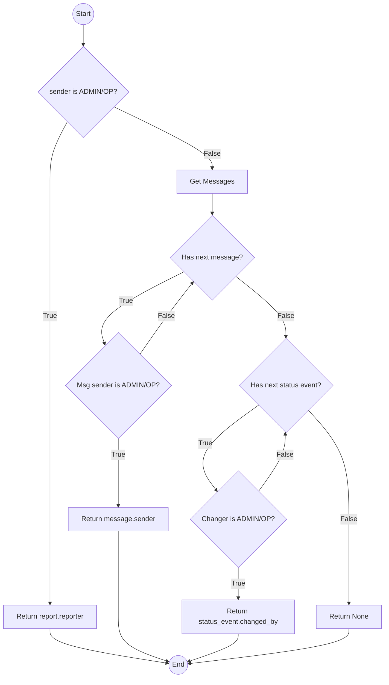

# Control Flow Graph: MessagingService._resolve_recipient

Questo documento contiene l'analisi strutturale del metodo `_resolve_recipient` per il Task 6 (White-Box Testing).

## Codice Sorgente

```python
def _resolve_recipient(self, report: Report, sender: User) -> User | None:
    if sender.role in {Role.ADMIN, Role.OPERATOR}:                          # N1
        return report.reporter                                              # N2 (EXIT)
    
    messages = self.message_repository.list_for_report(report.id)            # N3
    for message in reversed(messages):                                      # N4
        if message.sender and message.sender.role in {Role.ADMIN, Role.OPERATOR}: # N5
            return message.sender                                           # N6 (EXIT)
    
    for status_event in reversed(report.status_history):                    # N7
        if status_event.changed_by and status_event.changed_by.role in {Role.ADMIN, Role.OPERATOR}: # N8
            return status_event.changed_by                                  # N9 (EXIT)
    
    return None                                                             # N10 (EXIT)
```

## Nodi del Grafo

- **N1**: Decisione: `sender.role` è ADMIN o OPERATOR?
- **N2**: Ramo True di N1: Ritorna `report.reporter`.
- **N3**: Inizio scansione messaggi: Recupera lista messaggi.
- **N4**: Ciclo `for message in reversed(messages)` (Controllo se esiste un prossimo messaggio).
- **N5**: Decisione: `message.sender` esiste E ha ruolo ADMIN/OPERATOR?
- **N6**: Ramo True di N5: Ritorna `message.sender`.
- **N7**: Ciclo `for status_event in reversed(report.status_history)` (Controllo se esiste un prossimo evento).
- **N8**: Decisione: `status_event.changed_by` esiste E ha ruolo ADMIN/OPERATOR?
- **N9**: Ramo True di N8: Ritorna `status_event.changed_by`.
- **N10**: Ramo finale: Ritorna `None`.

## Mermaid Diagram



## Condizioni Atomiche

Per la **Condition Coverage**, analizziamo le espressioni logiche complesse:

1.  **C1**: `sender.role == Role.ADMIN`
2.  **C2**: `sender.role == Role.OPERATOR`
    *   Decisione N1: `C1 OR C2`
3.  **C3**: `message.sender is not None`
4.  **C4**: `message.sender.role == Role.ADMIN`
5.  **C5**: `message.sender.role == Role.OPERATOR`
    *   Decisione N5: `C3 AND (C4 OR C5)`
6.  **C6**: `status_event.changed_by is not None`
7.  **C7**: `status_event.changed_by.role == Role.ADMIN`
8.  **C8**: `status_event.changed_by.role == Role.OPERATOR`
    *   Decisione N8: `C6 AND (C7 OR C8)`
